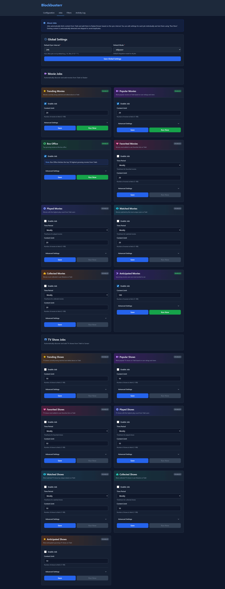

# Blockbusterr

Automatically add trending, popular, and highly-rated movies and TV shows from Trakt.tv to your Radarr and Sonarr instances.

## Screenshots
<details>
<summary>Click to expand screenshots</summary>

### Configuration


### Jobs


</details>

## Features

- **15 Automated Jobs**: Sync movies and TV shows from various Trakt lists
  - Trending, Popular, Box Office
  - Favorited, Played, Watched, Collected (by time period)
  - Anticipated content
- **Content Filtering**: Fine-grained control over what gets added to your library
  - Filter by country, language, genre, keywords
  - Block specific networks (Hallmark, Nickelodeon, etc.)
  - Set runtime and year ranges
  - Blacklist specific TMDB/TVDB IDs
- **Dual Integration Modes**:
  - **Direct Mode**: Add content directly to Radarr/Sonarr
  - **Jellyseerr Mode**: Request content via Jellyseerr/Overseerr with approval workflows
- **Web UI**: Manage jobs, filters, view activity logs, and configure settings
- **Flexible Scheduling**: Use simple durations (`1h`, `30m`) or cron expressions (`0 */2 * * *`)
- **Smart Duplicate Detection**: Prevents adding content that's already requested/added
- **Activity Logging**: Track all job executions and API actions
- **Configurable Limits**: Control how many items to add per job
- **Time Periods**: Choose weekly, monthly, yearly, or all-time for historical lists

## Quick Start

### Docker (Recommended)

1. **Start Blockbusterr:**

```bash
docker run -d \
  --name blockbusterr \
  -p 9090:9090 \
  -v $(pwd)/data:/app/data \
  -e TZ=America/New_York \
  ghcr.io/mahcks/blockbusterr:latest
```

Or with docker-compose:

```bash
docker-compose up -d
```

2. **Open the Web UI:** Navigate to http://localhost:9090

3. **Configure via Web Interface:**
   - Click on **Configuration** tab
   - Get Trakt API credentials from https://trakt.tv/oauth/applications
   - Enter your Radarr and Sonarr connection details
   - Test connections to verify
   - Load quality profiles and root folders
   - Save your configuration

4. **Set Up Filters (Optional):** Go to the **Filters** tab to control what content gets added
   - Filter movies and shows by country, language, genre
   - Block specific networks, keywords, or IDs
   - Set runtime and year limits

5. **Enable Jobs:** Go to the **Jobs** tab and enable the automation you want

That's it! No manual config file editing required.

### Build from Source

Requirements:
- Go 1.24 or later

```bash
# Clone the repository
git clone https://github.com/Mahcks/blockbusterr.git
cd blockbusterr

# Copy and configure
cp config/config.example.yaml config.yaml
# Edit config.yaml with your settings

# Build and run
go build -o bin/blockbusterr cmd/app/main.go
./bin/blockbusterr
```

## Configuration

### Web UI (Recommended)

The easiest way to configure Blockbusterr is through the built-in web interface at http://localhost:9090:

1. Navigate to the **Configuration** tab
2. Enter your Trakt, Radarr, and Sonarr credentials
3. Test connections to verify
4. Load and select quality profiles and root folders
5. Save configuration

The configuration will be automatically saved to `config.yaml` in the application directory.

### Manual Configuration (Advanced)

If you prefer to manually edit the configuration file, you can create a `config.yaml` file:

```yaml
rest:
  host: 0.0.0.0
  port: "9090"

trakt:
  client_id: "your_trakt_client_id"
  client_secret: "your_trakt_secret"

radarr:
  url: "http://localhost:7878"
  api_key: "your_radarr_api_key"
  quality_profile: 1
  root_folder: "/movies"

sonarr:
  url: "http://localhost:8989"
  api_key: "your_sonarr_api_key"
  quality_profile: 1
  root_folder: "/tv"

# Optional: Jellyseerr integration (alternative to direct mode)
jellyseerr:
  url: "http://localhost:5055"
  api_key: "your_jellyseerr_api_key"
  user_id: ""  # Optional: request as specific user

jobs:
  sync_interval: 24h  # or "0 2 * * *" for daily at 2 AM
  mode: direct  # "direct" or "jellyseerr"
  
  trending_movies:
    enabled: true
    limit: 20
  
  popular_shows:
    enabled: true
    limit: 10
  
  favorited_movies:
    enabled: true
    limit: 20
    period: weekly  # weekly, monthly, yearly, all

# Content Filters (optional)
filters:
  movies:
    allowed_countries: []  # e.g., ["us", "gb", "ca"]
    allowed_languages: []  # e.g., ["en", "ja"]
    blacklisted_genres: ["documentary"]
    blacklisted_keywords: []
    blacklisted_tmdb_ids: []
    blacklisted_min_runtime: 0  # minutes (0 = disabled)
    blacklisted_max_runtime: 0  # minutes (0 = disabled)
    blacklisted_min_year: 0  # e.g., 2020 (0 = disabled)
    blacklisted_max_year: 0  # e.g., 2024 (0 = disabled)
  
  shows:
    allowed_countries: []
    allowed_languages: []
    blacklisted_genres: ["reality"]
    blacklisted_keywords: []
    blacklisted_networks: ["hallmark", "nickelodeon"]
    blacklisted_tvdb_ids: []
    blacklisted_min_runtime: 0
    blacklisted_max_runtime: 0
    blacklisted_min_year: 0
    blacklisted_max_year: 0
```

### Schedule Formats

**Duration Format:**
- `30m` - Every 30 minutes
- `1h` - Every 1 hour
- `2h30m` - Every 2 hours and 30 minutes

**Cron Expression:**
- `0 */2 * * *` - Every 2 hours
- `0 0 * * *` - Daily at midnight
- `0 2 * * *` - Daily at 2 AM
- `0 */6 * * *` - Every 6 hours

### Environment Variables

Override config values with environment variables:

```bash
REST_PORT=9090
TRAKT_CLIENT_ID=your_client_id
TRAKT_CLIENT_SECRET=your_client_secret
RADARR_URL=http://radarr:7878
RADARR_API_KEY=your_key
SONARR_URL=http://sonarr:8989
SONARR_API_KEY=your_key
JELLYSEERR_URL=http://jellyseerr:5055
JELLYSEERR_API_KEY=your_key
```

## Integration Modes

### Direct Mode (Default)
Adds content directly to Radarr and Sonarr. Requires:
- Radarr URL, API key, quality profile, and root folder
- Sonarr URL, API key, quality profile, and root folder

Content is immediately added and starts downloading based on your *arr settings.

### Jellyseerr Mode
Requests content via Jellyseerr/Overseerr. Requires:
- Jellyseerr URL and API key
- Optional: User ID to request as specific user

Content goes through Jellyseerr's approval workflow (if configured) before being sent to Radarr/Sonarr. Perfect for multi-user setups with request management.

**To enable Jellyseerr mode:**
1. Configure Jellyseerr in the Configuration page
2. Select "Jellyseerr Mode" in the Integration Mode section
3. Save configuration

## Content Filters

Control exactly what content gets added to your library through the Filters page at `http://localhost:9090/filters`.

### Filter Options

**For Both Movies and Shows:**
- **Allowed Countries**: Only add content from specific countries (2-letter codes: `us`, `gb`, `ca`, etc.)
  - Leave empty to allow all countries
  - Use `["ignore"]` to allow content with no country specified
- **Allowed Languages**: Only add content in specific languages (2-letter codes: `en`, `ja`, `es`, etc.)
  - Leave empty to allow all languages
  - Use `["ignore"]` to allow content with no language specified
- **Blacklisted Genres**: Block specific genres entirely
  - Movies: `documentary`, `animation`, `music`, etc.
  - Shows: `reality`, `talk-show`, `game-show`, `documentary`, etc.
  - Use `["ignore"]` to allow content with no genres specified
- **Blacklisted Keywords**: Block content with specific words in the title
- **Blacklisted IDs**: Block specific TMDB IDs (movies) or TVDB IDs (shows)
- **Runtime Range**: Set minimum and maximum runtime in minutes
  - Example: Skip movies under 60 minutes or over 180 minutes
  - Set to `0` to disable
- **Year Range**: Only add content released within a specific year range
  - Example: Only movies from 2020 onwards
  - Set to `0` to disable

**TV Shows Only:**
- **Blacklisted Networks**: Block entire TV networks
  - Examples: `hallmark`, `nickelodeon`, `disney channel`, `lifetime`
  - Perfect for avoiding holiday movie spam or kids' content

### Filter Examples

**Only English movies from 2020+ without documentaries:**
```yaml
filters:
  movies:
    allowed_languages: ["en"]
    blacklisted_genres: ["documentary"]
    blacklisted_min_year: 2020
```

**Block all Hallmark and reality TV shows:**
```yaml
filters:
  shows:
    blacklisted_networks: ["hallmark", "lifetime"]
    blacklisted_genres: ["reality", "game-show"]
```

**Only feature-length English movies (90-180 mins):**
```yaml
filters:
  movies:
    allowed_languages: ["en"]
    blacklisted_min_runtime: 90
    blacklisted_max_runtime: 180
```

**Note:** Filters are applied to ALL jobs. If a movie or show is filtered out, it won't be added regardless of which job found it.

## Available Jobs

### Movie Jobs
- **Trending Movies**: Currently trending on Trakt
- **Popular Movies**: Most popular movies this week
- **Box Office**: Top box office movies
- **Favorited Movies**: Most favorited by time period
- **Played Movies**: Most played by time period
- **Watched Movies**: Most watched by time period
- **Collected Movies**: Most collected by time period
- **Anticipated Movies**: Most anticipated upcoming releases

### TV Show Jobs
- **Trending Shows**: Currently trending on Trakt
- **Popular Shows**: Most popular shows this week
- **Favorited Shows**: Most favorited by time period
- **Played Shows**: Most played by time period
- **Watched Shows**: Most watched by time period
- **Collected Shows**: Most collected by time period
- **Anticipated Shows**: Most anticipated upcoming releases

## Web UI

Access the web interface at `http://localhost:9090` (change port via Docker port mapping)

**Features:**
- **Configuration Page**: Set up Trakt, Radarr, and Sonarr credentials with connection testing
- **Filters Page**: Configure content filters to control what gets added to your library
- **Jobs Page**: Enable/disable jobs, configure limits and time periods, run jobs manually
- **Activity Log**: View detailed execution history with success/failure tracking
- **Real-time Updates**: Live job status and instant notifications

### Docker Configuration Options

**Option 1: Use Web UI (Recommended)**

The config is automatically saved to `/app/data/config.yaml` inside the container:

```bash
docker run -d \
  --name blockbusterr \
  -p 9090:9090 \
  -v $(pwd)/data:/app/data \
  ghcr.io/mahcks/blockbusterr:latest
```

**Option 2: Mount Your Config File**

```bash
docker run -d \
  --name blockbusterr \
  -p 9090:9090 \
  -v $(pwd)/config.yaml:/app/config/config.yaml:ro \
  -v $(pwd)/data:/app/data \
  ghcr.io/mahcks/blockbusterr:latest
```

**Option 3: Custom Config Location**

```bash
docker run -d \
  --name blockbusterr \
  -p 9090:9090 \
  -v $(pwd)/my-config:/config \
  -v $(pwd)/data:/app/data \
  -e CONFIG_PATH=/config \
  ghcr.io/mahcks/blockbusterr:latest
```

**Option 4: Environment Variables Only**

```bash
docker run -d \
  --name blockbusterr \
  -p 9090:9090 \
  -v $(pwd)/data:/app/data \
  -e TRAKT_CLIENT_ID=your_id \
  -e TRAKT_CLIENT_SECRET=your_secret \
  -e RADARR_URL=http://radarr:7878 \
  -e RADARR_API_KEY=your_key \
  ghcr.io/mahcks/blockbusterr:latest
```

**Disable Web UI (Config File Only):**

If you want to use only the config file without the web interface:

```bash
docker run -d \
  --name blockbusterr \
  -p 9090:9090 \
  -v $(pwd)/config.yaml:/app/config/config.yaml \
  -v $(pwd)/data:/app/data \
  -e DISABLE_UI=true \
  ghcr.io/mahcks/blockbusterr:latest
```

## Building Docker Image

```bash
# Build
docker build -t ghcr.io/mahcks/blockbusterr:latest .

# Push (if publishing)
docker push ghcr.io/mahcks/blockbusterr:latest
```

## Development

```bash
# Run in development mode (uses config.dev.yaml)
go run cmd/app/main.go

# Build
go build -o bin/blockbusterr cmd/app/main.go

# Run tests
go test ./...
```

## API Endpoints

### Web UI Pages
- `GET /` - Home page
- `GET /config` - Configuration page
- `GET /filters` - Content filters page
- `GET /jobs` - Jobs configuration page
- `GET /activity` - Activity logs page

### API Endpoints
- `GET /api/v1/jobs/status` - Get all job statuses (JSON)
- `POST /api/v1/jobs/{job-name}/trigger` - Manually trigger a job
- `POST /jobs/config/save` - Save job configuration
- `POST /config/filters` - Save filter configuration
- `GET /v1/trakt/networks` - Get available TV networks from Trakt
- `GET /v1/trakt/genres/{type}` - Get genres for movies or shows
- `GET /v1/trakt/countries` - Get available countries
- `GET /v1/trakt/languages` - Get available languages

## Troubleshooting

**First-time setup:**
- Just start the container and open http://localhost:9090
- Use the Configuration page to enter your credentials
- Test connections before saving
- Configuration will be automatically created

**Jobs not running:**
- Check that jobs are enabled in the Jobs page or `config.yaml`
- Verify Trakt API credentials in Configuration page
- Check Radarr/Sonarr URLs and API keys

**Config changes not saving:**
- Ensure the `/app/data` directory is writable
- If mounting config file, make sure it's not read-only
- Note: Comments in manually edited config files will be removed after saving via web UI

**Connection test failures:**
- Verify URLs don't have trailing slashes
- Ensure API keys are correct (check Radarr/Sonarr settings)
- For Docker containers, use container names or host networking

## License

MIT License - see [LICENSE](LICENSE) file for details

## Contributing

Contributions are welcome! Please feel free to submit a Pull Request.

## Credits

Built with:
- [Fiber](https://github.com/gofiber/fiber) - Web framework
- [Viper](https://github.com/spf13/viper) - Configuration management
- [robfig/cron](https://github.com/robfig/cron) - Cron expression parsing
- [Trakt.tv API](https://trakt.tv) - Content data source