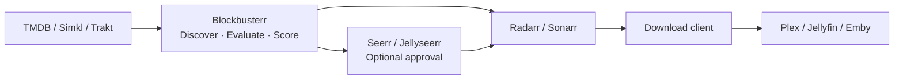
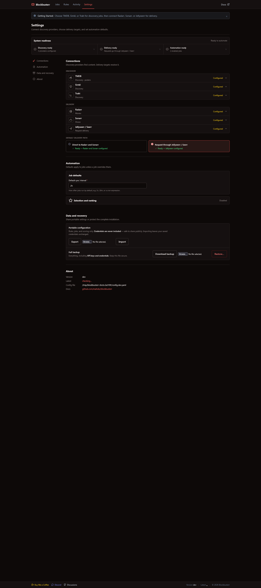
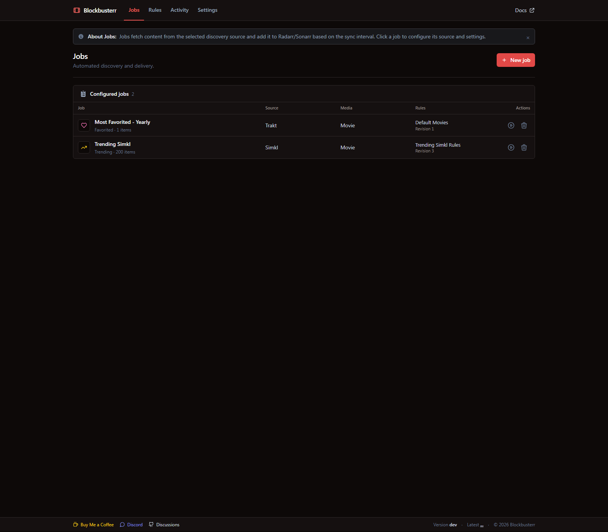
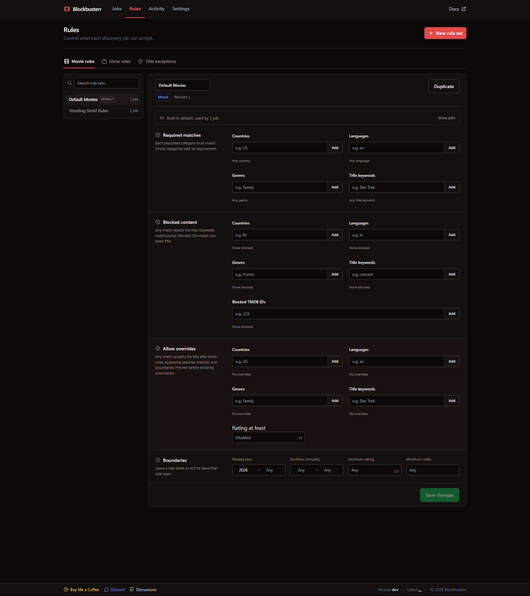

# Blockbusterr

**Automate your media library with smart content discovery from TMDB, Simkl, or Trakt.**

Blockbusterr discovers movies and shows worth watching, evaluates them with reusable rules, and delivers accepted titles to Radarr, Sonarr, Jellyseerr, or Seerr on a schedule.

**Trakt is optional.** A single supported discovery provider—TMDB, Simkl, or Trakt—is enough to run Blockbusterr.

[](https://github.com/Mahcks/blockbusterr/releases)
[](https://github.com/mahcks/blockbusterr/pkgs/container/blockbusterr)
[](LICENSE)
[](https://blockbusterr.dev/)
[](https://discord.com/invite/c8vb3VZqmg)

---

## Where Blockbusterr Fits

Blockbusterr is the discovery and decision layer in your media stack. It watches TMDB, Simkl, or Trakt for content that matches your scheduled jobs, applies the assigned rules and scoring, then sends qualifying movies and shows into the tools you already use.



Blockbusterr does not replace your request manager, `*arr` apps, download client, or media server. It connects them with automated, explainable discovery—helping your library find its next additions without relying on manual requests or unfiltered lists.

> **Build a fully automated library loop:** Pair Blockbusterr with [Maintainerr](https://github.com/Maintainerr/Maintainerr). Blockbusterr discovers and adds content you'll want to watch; Maintainerr can identify stale or unwatched media and remove or unmonitor it using your cleanup rules. The projects operate independently, so coordinate their rules and Blockbusterr exclusions to avoid repeatedly rediscovering removed titles.

---

## Documentation

**Full documentation available at [blockbusterr.dev](https://blockbusterr.dev/)**

- [Quick Start Guide](https://blockbusterr.dev/getting-started/quickstart/)
- [Installation Methods](https://blockbusterr.dev/getting-started/installation/)
- [Configuration](https://blockbusterr.dev/getting-started/configuration/)
- [Jobs Overview](https://blockbusterr.dev/concepts/jobs/)
- [Rules](https://blockbusterr.dev/concepts/filters/)
- [Upgrading to v2](https://blockbusterr.dev/getting-started/upgrading-to-v2/)
- [Real-World Examples](https://blockbusterr.dev/examples/use-cases/)
- [API Reference](https://blockbusterr.dev/api/overview/)

---

## Quick Start

**Get running in 60 seconds:**

```bash
docker run -d \
  --name blockbusterr \
  -p 9090:9090 \
  -v $(pwd)/data:/app/data \
  ghcr.io/mahcks/blockbusterr:latest
```

Then open `http://localhost:9090` and configure your services.

**[→ Full Quick Start Guide](https://blockbusterr.dev/getting-started/quickstart/)**

---

## Features

- **Flexible Discovery Jobs** - Trending, popular, anticipated, favorited, box office, and more
- **Multiple Discovery Sources** - Use TMDB, Simkl, or Trakt per job
- **Reusable Rules** - Share policies between jobs or create a job-specific copy
- **Title Exceptions** - Always allow or block a provider title across every job
- **Weighted Scoring** - Rank candidates by rating, popularity, and recency
- **Delivery Budgets** - Cap successful deliveries per job and across rolling time periods
- **Two Integration Modes** - Direct to Radarr/Sonarr or through Jellyseerr/Seerr for approval
- **Explainable Activity** - Inspect Activity Entries and complete Job Run outcomes
- **Job Preview** - Test configurations before enabling to avoid surprises
- **Unified Dashboard** - Manage movies and TV shows in one place
- **Smart Jobs** - Adaptive scoring that balances popularity with quality

---

## Screenshots

### Dashboard & Configuration


### Job Preview & Management


### Reusable Rules


### Activity Entries and Job Runs


---

## Why Blockbusterr?

**The Problem:** Native discovery lists are fragmented across providers and delivery tools, with limited policy control and no unified explanation of each decision.

**The Solution:** Build discovery jobs from the providers you prefer, assign reusable rules, preview the result, and understand every run from one interface.

| Feature | Manual Trakt Lists | Blockbusterr |
|---------|-------------------|--------------|
| Setup | Configure in each *arr app | One unified dashboard |
| Limits | All or nothing | Discovery limits plus enforced delivery budgets |
| Rules | Limited or provider-specific | Reusable allow, require, block, and boundary policies |
| Activity | Check each app separately | Activity Entries and Job Runs |
| Preview | No preview capability | Test before enabling |

---

## Use Cases

- **Family Server** - Block R-rated content, require G/PG/PG-13 only
- **Quality Curator** - Only add movies scoring 80+, minimum 50k IMDb votes
- **Genre Specialist** - Sci-fi and fantasy only, no comedies or romance
- **Completionist** - Add everything trending with minimal filtering

**[→ See Real-World Examples](https://blockbusterr.dev/examples/use-cases/)**

---

## Installation

**Docker Compose** (Recommended):

```yaml
version: '3.8'
services:
  blockbusterr:
    image: ghcr.io/mahcks/blockbusterr:latest
    container_name: blockbusterr
    ports:
      - "9090:9090"
    volumes:
      - ./data:/app/data
    environment:
      - TZ=America/New_York
    restart: unless-stopped
```

**Other methods:** Binary, from source, with full stack → **[Installation Guide](https://blockbusterr.dev/getting-started/installation/)**

---

## Configuration

Blockbusterr can be configured via:
- **Web UI** - `http://localhost:9090` (easiest)
- **config.yaml** - Mount as volume or edit in container
- **Environment Variables** - For Docker deployments

**[→ Configuration Guide](https://blockbusterr.dev/getting-started/configuration/)**

---

## How It Works

1. **Jobs run on schedule** (cron) - e.g., "Trending Movies" every 6 hours
2. **Fetch content from your selected source** - TMDB, Simkl, or Trakt
3. **Evaluate assigned rules** - Allow, require, block, and boundary checks
4. **Calculate scores** - Rank candidates by configurable rating, popularity, and recency weights
5. **Check threshold** - Only content scoring above threshold proceeds
6. **Add to library** - Direct to Radarr/Sonarr or create a Jellyseerr/Seerr request
7. **Record outcomes** - Explain every title and summarize the complete job run

**[→ Learn About Jobs](https://blockbusterr.dev/concepts/jobs/)** | **[→ Learn About Rules](https://blockbusterr.dev/concepts/filters/)**

---

## Contributing

Contributions welcome! Please open an issue or PR.

**Development:**

```bash
git clone https://github.com/mahcks/blockbusterr.git
cd blockbusterr
make dev
```
---

## Community

Join our Discord for support, questions, and discussion:  
[https://discord.com/invite/c8vb3VZqmg](https://discord.com/invite/c8vb3VZqmg)

---

## License

MIT License - see [LICENSE](LICENSE) file for details.

---

## Support

If Blockbusterr saves you time, consider giving it a star!

[](https://star-history.com/#Mahcks/blockbusterr&Date)


**Made for the *arr community** 
