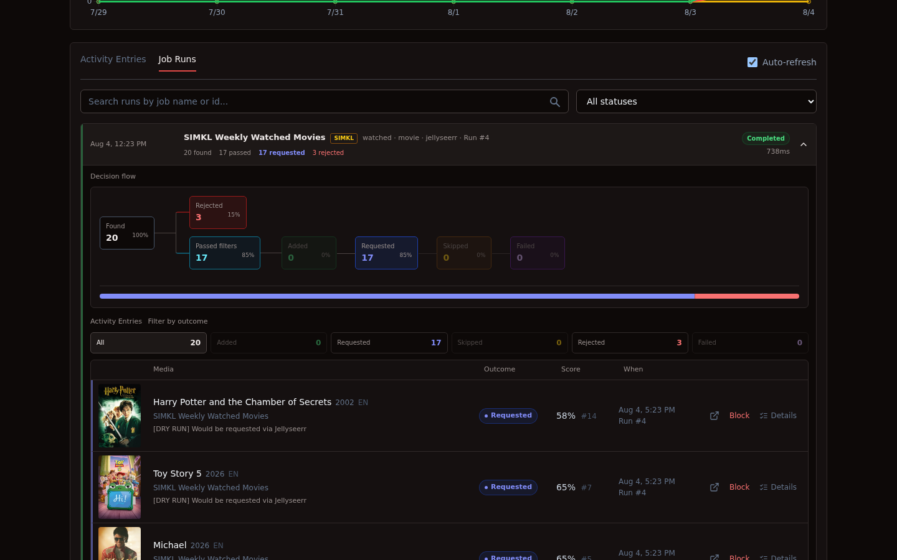
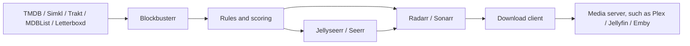

# Blockbusterr

> [!IMPORTANT]
> **Blockbusterr v2.0.0-rc.1 is a release candidate.** Stable `latest` remains on v1; `latest-beta` follows prereleases. Read the [documentation](https://blockbusterr.dev/) and [release notes](https://github.com/Mahcks/blockbusterr/releases/tag/v2.0.0-rc.1). Upgrading from v1? Back up your complete data directory and follow the [upgrade guide](https://blockbusterr.dev/getting-started/upgrading-to-v2/).

**Automated media discovery with rule-based decision making for self-hosted libraries.**

Blockbusterr follows trends, lists, and watchlists from the providers you already use. It evaluates every movie or show against your rules, ranks the candidates, and sends the winners to Radarr, Sonarr, Jellyseerr, or Seerr.

Rather than importing everything from a trending list or watchlist, Blockbusterr evaluates every candidate using reusable rules, scoring, repeat handling, delivery limits, and title exceptions before deciding whether it belongs in your library. Every decision is recorded so you can see exactly why a title was accepted, skipped, or rejected.

New here? Start with the **[60-second quick start](https://blockbusterr.dev/v2/getting-started/quickstart/)** or browse the **[complete documentation](https://blockbusterr.dev/v2/)**.

[](https://github.com/Mahcks/blockbusterr/releases)
[](https://github.com/mahcks/blockbusterr/pkgs/container/blockbusterr)
[](https://blockbusterr.dev/v2/)
[](LICENSE)
[](https://discord.com/invite/c8vb3VZqmg)



Blockbusterr is designed to automate discovery without turning your library into a firehose. Every candidate passes through the same repeatable decision process before anything is delivered.

## Where it fits

Blockbusterr is the discovery and decision layer in a homelab media stack. It does not replace your request manager, `*arr` applications, download client, or media server.

Instead, it sits between discovery and delivery, deciding which titles should reach the rest of your stack.



One discovery provider is enough. Mix providers when you want different jobs to serve different purposes, such as trending movies, a personal watchlist, family-safe shows, or a tightly curated public list.

Pair Blockbusterr with [Maintainerr](https://github.com/Maintainerr/Maintainerr) to create a complete library lifecycle. Blockbusterr discovers suitable content; Maintainerr can remove or unmonitor stale and unwatched media. Repeat handling and title exceptions prevent removed titles from immediately returning.

## Features

- **[Preview-first jobs](https://blockbusterr.dev/v2/concepts/jobs/#preview-run-and-schedule):** inspect candidates and rule decisions before enabling delivery.
- **[Reusable rules](https://blockbusterr.dev/v2/concepts/rules/#the-v2-model):** assign a movie or show policy to many jobs, or create a job-specific copy.
- **[Lists and watchlists](https://blockbusterr.dev/v2/concepts/jobs/#discovery-types):** follow Trakt, TMDB, MDBList, and experimental public Letterboxd sources.
- **[Recipes and custom jobs](https://blockbusterr.dev/v2/concepts/jobs/#built-in-recipes):** start from a safe built-in recipe or configure the complete discovery flow yourself.
- **Decision history:** every title has an outcome, reason, score, source, and Job Run.
- **[Ranked selection](https://blockbusterr.dev/v2/concepts/jobs/#ranked-selection-cycles):** let participating jobs compete for a shared number of movie or show slots.
- **Delivery safeguards:** combine [delivery budgets](https://blockbusterr.dev/v2/getting-started/configuration/#delivery-budgets), [previews](https://blockbusterr.dev/v2/concepts/jobs/#preview-run-and-schedule), [repeat handling](https://blockbusterr.dev/v2/getting-started/configuration/#repeat-handling), and [title exceptions](https://blockbusterr.dev/v2/concepts/rules/#title-exceptions).
- **[Two delivery paths](https://blockbusterr.dev/v2/concepts/integration-modes/):** add directly to Radarr and Sonarr, or request through Jellyseerr or Seerr.
- **[Portable configuration](https://blockbusterr.dev/v2/api/config/#portable-configuration):** export shareable jobs and rules separately from credentialed backups.
- **Single-container deployment:** compiled frontend assets, the API, and SQLite are bundled together in one lightweight Docker image with no required external database.

## Integrations and compatibility

| Role | Services | Notes |
| --- | --- | --- |
| Discovery | [TMDB](https://blockbusterr.dev/v2/integrations/tmdb/), [Simkl](https://blockbusterr.dev/v2/integrations/simkl/), [Trakt](https://blockbusterr.dev/v2/integrations/trakt/) | Trending, popular, anticipated, history-based jobs, lists, and watchlists vary by provider |
| Curated lists | [MDBList](https://blockbusterr.dev/v2/integrations/mdblist/) | Public lists and the API-key owner's watchlist; also provides a bridge for imported IMDb and Letterboxd lists |
| Experimental lists | Letterboxd | Public lists only; direct scraping is opt-in and may stop working if Letterboxd changes its site |
| Direct delivery | [Radarr](https://blockbusterr.dev/v2/integrations/radarr/), [Sonarr](https://blockbusterr.dev/v2/integrations/sonarr/) | Adds movies and shows using the selected quality profile, root folder, monitoring behavior, and other delivery settings |
| Request delivery | [Jellyseerr and Seerr](https://blockbusterr.dev/v2/integrations/jellyseerr/) | Submits requests through the configured application user or optional request credentials |
| Downstream playback | Plex, Jellyfin, Emby, and other media servers | Compatible with any media server using a Radarr/Sonarr-managed library; Blockbusterr does not communicate with the media server directly |

Trakt is optional. Personal Trakt and TMDB watchlists require account authorization; public discovery only needs the provider's application credentials.

Blockbusterr is media-server agnostic. Its delivery boundary is Radarr, Sonarr, Jellyseerr, or Seerr; your existing media stack handles downloading and playback after that.

Want support for another discovery provider, list source, direct delivery target, or request manager? Feature requests and pull requests are always welcome!

## Quick start

```bash
docker volume create blockbusterr-data

docker run -d \
  --name blockbusterr \
  --restart unless-stopped \
  -p 9090:9090 \
  -v blockbusterr-data:/app/data \
  ghcr.io/mahcks/blockbusterr:v2.0.0-rc.1
```

Open `http://localhost:9090`, connect one discovery provider and one delivery target, then create and preview a job.

Blockbusterr has no login requirement by default. Keep it on a trusted LAN, behind an authenticated reverse proxy or VPN, or set `BLOCKBUSTERR_AUTH_TOKEN` to a random value of at least 32 characters. The username is `blockbusterr`.

[Read the quick start](https://blockbusterr.dev/v2/getting-started/quickstart/) · [Installation options](https://blockbusterr.dev/v2/getting-started/installation/) · [Unraid, TrueNAS SCALE, and Portainer](https://blockbusterr.dev/v2/getting-started/deployment-platforms/) · [Upgrade from v1](https://blockbusterr.dev/v2/getting-started/upgrading-to-v2/)

## See it in use

### Jobs

Each job owns its source, media type, schedule, delivery behavior, and assigned rules. Built-in recipes are created disabled so they can be reviewed and previewed first.


### Rules

Movie and show rule sets can require or block countries, languages, genres, keywords, networks, years, runtimes, ratings, votes, and provider IDs. Title exceptions apply across jobs.


### Activity Entries

Every automated decision is recorded in Activity Entries, including the title, source, outcome, score, rank, timestamp, and the reason behind the decision.


### Settings

Settings keeps provider health, delivery targets, scoring, ranked selection, repeat handling, delivery limits, backup, and recovery in one place.


## Job lifecycle

1. Fetch candidates from the job's selected source.
2. Normalize provider data to a movie or show identity.
3. Apply the assigned rules and universal title exceptions.
4. Skip titles already present or blocked by repeat handling.
5. Score and rank the remaining candidates when scoring is enabled.
6. Enforce job, ranked-selection, and rolling delivery limits.
7. Add to Radarr or Sonarr, or submit a Jellyseerr or Seerr request.
8. Record the complete decision flow in Activity Entries and Job Runs.

Removing an item from a source list never deletes media that Blockbusterr already delivered.

## Documentation

- [Jobs and recipes](https://blockbusterr.dev/v2/concepts/jobs/)
- [Rules and title exceptions](https://blockbusterr.dev/v2/concepts/rules/)
- [Integration modes](https://blockbusterr.dev/v2/concepts/integration-modes/)
- [Configuration reference](https://blockbusterr.dev/v2/getting-started/configuration/)
- [Real-world examples](https://blockbusterr.dev/v2/examples/use-cases/)
- [API reference](https://blockbusterr.dev/v2/api/overview/)

## Development

```bash
git clone https://github.com/Mahcks/blockbusterr.git
cd blockbusterr
make dev
```

Contributions are welcome. Please open an issue or pull request, or join the [Discord community](https://discord.com/invite/c8vb3VZqmg).

## License

[MIT](LICENSE), made for the self-hosted media community.
