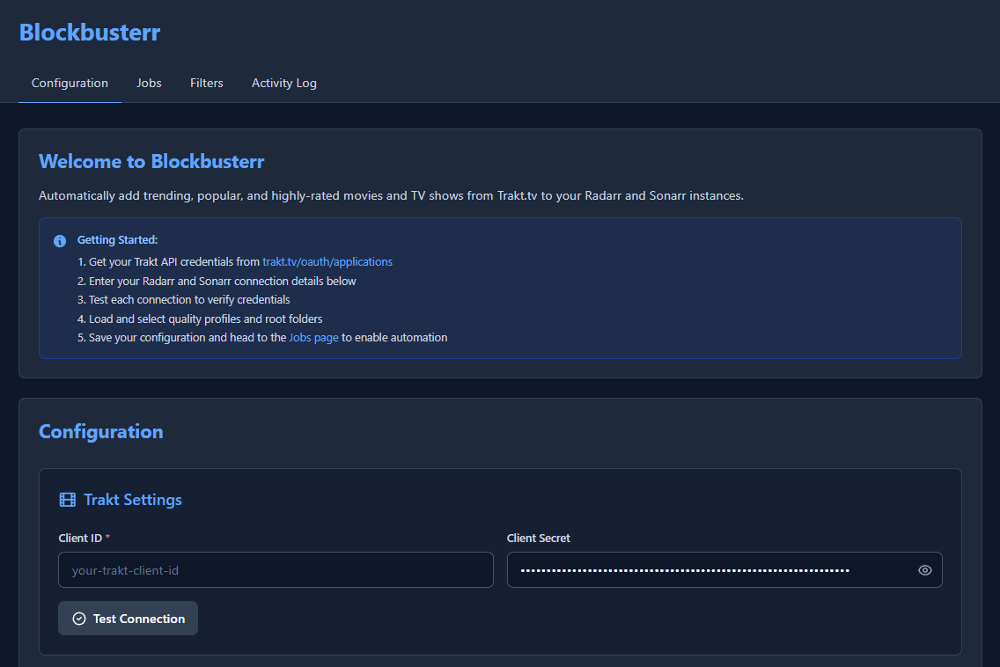
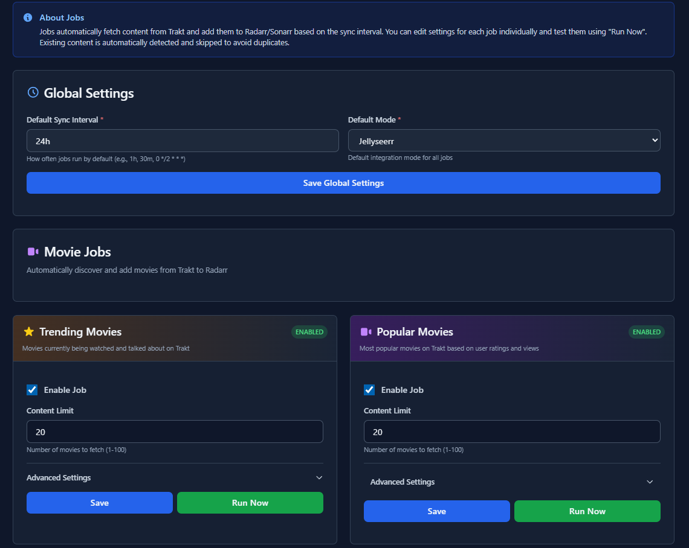
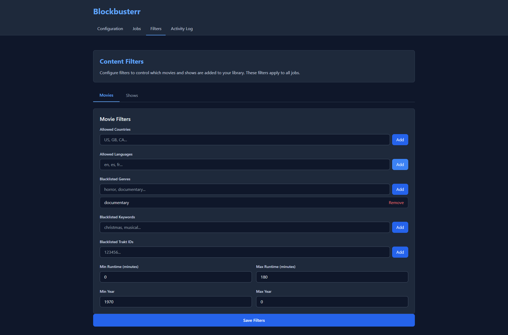
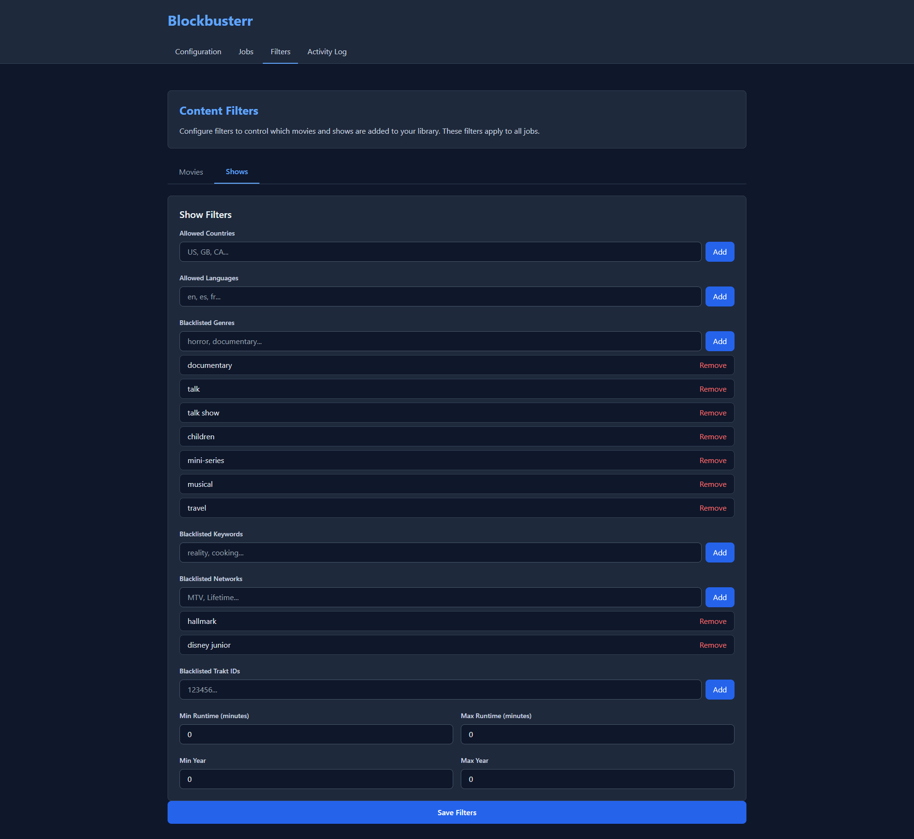

# Blockbusterr

Automate your media library. Stop manually managing Trakt lists.

Blockbusterr pulls trending, popular, and highly-rated content from Trakt and adds it to Radarr/Sonarr automatically. Smart filters ensure you only get the content you actually want.

[](https://github.com/Mahcks/blockbusterr/releases)
[](https://github.com/mahcks/blockbusterr/pkgs/container/blockbusterr)
[](LICENSE)

---

## Quick Start

**1. Run Blockbusterr**

```bash
docker run -d \
  --name blockbusterr \
  -p 9090:9090 \
  -v $(pwd)/data:/app/data \
  ghcr.io/mahcks/blockbusterr:latest
```

**2. Connect Your Apps**

Open `http://localhost:9090` and add your Radarr/Sonarr credentials in the Configuration tab.



**3. Enable Jobs**

Pick a job like "Trending Movies" or "Popular Shows" and click Enable.



That's it. Blockbusterr will now keep your library fresh automatically.

---

## Screenshots

<details>
<summary>More screenshots</summary>

**Movie Filters**


**Show Filters**


</details>

---

## Why Use This?

**The Problem:**
Managing Trakt lists manually in Radarr/Sonarr is tedious. You have to:
- Configure each list separately in each app
- Accept everything from a list (can't limit to just "top 5")
- No filtering by rating, country, or quality
- No unified view of what was added across apps
- Repeat this whole process for every list you want

**What This Does:**
- One dashboard for both movies and TV shows
- Smart filtering (country, language, genre, runtime, year, keywords)
- Limit control ("top 5 trending" instead of "all 100 trending movies")
- Activity log showing what was added and when
- Preview before adding (coming soon)
- Optional Jellyseerr integration for approval workflows

| Feature | Manual Trakt Lists | Blockbusterr |
|---------|-------------------|--------------|
| Setup | Configure in each *arr app | One config |
| Limits | All or nothing | Top N items per job |
| Filters | None | Country, language, genre, runtime, year, keywords |
| Management | Multiple apps | Single dashboard |
| Activity Log | Check each app | Unified log with posters |
| Preview | Blind faith | See before adding (coming soon) |
| Multi-user | Direct add only | Optional Jellyseerr approval |

---

## Features

### 15 Automated Jobs

Pull content from Trakt automatically:
- **Trending** - What's hot right now
- **Popular** - Most watched this week
- **Box Office** - Top movies at the box office
- **Favorited** - Most favorited (weekly/monthly/yearly/all-time)
- **Played** - Most played by time period
- **Watched** - Most watched by time period
- **Collected** - Most collected by time period
- **Anticipated** - Most anticipated upcoming releases

All jobs work for both movies and TV shows (15 total).

### Smart Filtering

Control what gets added:
- **Country & Language** - Only specific countries/languages (e.g., US/UK English only)
- **Genre Blacklists** - Block documentaries, reality TV, etc.
- **Network Blacklists** - Block Hallmark, Nickelodeon, specific networks
- **Runtime Ranges** - Feature films only (90-180 mins)
- **Year Ranges** - Only content from 2020 onwards
- **Keyword Blacklists** - Block titles containing specific words
- **ID Blacklists** - Block specific TMDB/TVDB IDs

### Two Integration Modes

**Direct Mode (Default)**
- Adds content straight to Radarr/Sonarr
- Immediate download based on your *arr settings
- Best for single-user setups

**Jellyseerr Mode**
- Routes requests through Jellyseerr/Overseerr
- Approval workflow for multi-user servers
- Quota management and request tracking

### Web Dashboard

- Configure Trakt, Radarr, Sonarr with connection testing
- Enable/disable jobs, set limits, run jobs manually
- Configure filters visually
- Activity log with timestamps and poster images
- Real-time job status updates

### Flexible Scheduling

Simple duration format:
- `30m` - Every 30 minutes
- `2h` - Every 2 hours
- `24h` - Daily

Or cron expressions:
- `0 2 * * *` - Daily at 2 AM
- `0 */6 * * *` - Every 6 hours
- `0 0 * * 0` - Weekly on Sunday

---

## Installation

### Docker (Recommended)

**Basic:**
```bash
docker run -d \
  --name blockbusterr \
  -p 9090:9090 \
  -v $(pwd)/data:/app/data \
  ghcr.io/mahcks/blockbusterr:latest
```

**Docker Compose:**
```yaml
version: '3.8'
services:
  blockbusterr:
    image: ghcr.io/mahcks/blockbusterr:latest
    container_name: blockbusterr
    ports:
      - "9090:9090"
    volumes:
      - ./data:/app/data
    environment:
      - TZ=America/New_York
    restart: unless-stopped
```

**Pre-configured:**
```bash
docker run -d \
  --name blockbusterr \
  -p 9090:9090 \
  -v $(pwd)/data:/app/data \
  -e TRAKT_CLIENT_ID=your_client_id \
  -e TRAKT_CLIENT_SECRET=your_secret \
  -e RADARR_URL=http://radarr:7878 \
  -e RADARR_API_KEY=your_key \
  -e SONARR_URL=http://sonarr:8989 \
  -e SONARR_API_KEY=your_key \
  ghcr.io/mahcks/blockbusterr:latest
```

### Build from Source

Requirements: Go 1.24+

```bash
git clone https://github.com/Mahcks/blockbusterr.git
cd blockbusterr

# Copy example config (optional - can use web UI)
cp config/config.example.yaml config.yaml

# Build and run
go build -o bin/blockbusterr cmd/app/main.go
./bin/blockbusterr
```

---

## Setup Guide

### 1. Get Trakt API Credentials

1. Go to https://trakt.tv/oauth/applications
2. Create a new application
3. Save your Client ID and Client Secret

### 2. Configure Blockbusterr

Open `http://localhost:9090` and:

**Configuration Tab:**
- Enter Trakt credentials
- Add Radarr URL and API key
- Add Sonarr URL and API key
- Test connections
- Load quality profiles and root folders
- Save

**Filters Tab (Optional but Recommended):**
- Set country/language filters
- Blacklist genres you don't want
- Set runtime and year ranges
- Block specific networks

**Jobs Tab:**
- Enable jobs you want (e.g., "Trending Movies")
- Set limits (how many items to add per run)
- Configure schedules
- Save

### 3. Test It

- Go to Jobs tab
- Click "Trigger" next to a job
- Check Activity tab to see results

---

## Configuration Examples

### Family-Friendly Setup

Only English content, no adult themes:

```yaml
filters:
  movies:
    allowed_languages: ["en"]
    blacklisted_genres: ["horror", "thriller"]
    blacklisted_keywords: ["explicit", "unrated"]
    blacklisted_min_year: 2015

  shows:
    allowed_languages: ["en"]
    blacklisted_genres: ["horror", "reality"]
    blacklisted_networks: ["hbo", "showtime"]
```

### Quality Over Quantity

Top-rated recent content only:

```yaml
jobs:
  trending_movies:
    enabled: true
    limit: 5  # Top 5 only

  popular_movies:
    enabled: true
    limit: 3

filters:
  movies:
    allowed_countries: ["us", "gb", "ca"]
    blacklisted_genres: ["documentary"]
    blacklisted_min_year: 2020
    blacklisted_min_runtime: 90
```

### Block Holiday Spam

Avoid seasonal content:

```yaml
filters:
  movies:
    blacklisted_keywords: ["christmas", "holiday", "valentine"]

  shows:
    blacklisted_networks: ["hallmark", "lifetime", "disney channel"]
```

---

## Advanced Configuration

### Manual Config File

If you prefer YAML over the web UI, create `config.yaml`:

```yaml
trakt:
  client_id: "your_trakt_client_id"
  client_secret: "your_trakt_secret"

radarr:
  url: "http://localhost:7878"
  api_key: "your_radarr_api_key"
  quality_profile: 1
  root_folder: "/movies"

sonarr:
  url: "http://localhost:8989"
  api_key: "your_sonarr_api_key"
  quality_profile: 1
  root_folder: "/tv"

jellyseerr:  # Optional
  url: "http://localhost:5055"
  api_key: "your_jellyseerr_api_key"
  user_id: ""
  # Optional: Use username/password for requests (respects user permissions, no auto-approve)
  request_credentials:
    email: "blockbusterr-bot@example.com"
    password: "your_password"

jobs:
  sync_interval: "0 2 * * *"  # Daily at 2 AM
  mode: "direct"  # "direct" or "jellyseerr"

  trending_movies:
    enabled: true
    limit: 10

  popular_shows:
    enabled: true
    limit: 5

filters:
  movies:
    allowed_countries: ["us", "gb"]
    allowed_languages: ["en"]
    blacklisted_genres: ["documentary"]
    blacklisted_min_runtime: 90
    blacklisted_min_year: 2020

  shows:
    allowed_languages: ["en"]
    blacklisted_networks: ["hallmark"]
    blacklisted_genres: ["reality", "game-show"]
```

### Environment Variables

Override config via environment:

```bash
REST_PORT=9090
TRAKT_CLIENT_ID=your_id
TRAKT_CLIENT_SECRET=your_secret
RADARR_URL=http://radarr:7878
RADARR_API_KEY=your_key
SONARR_URL=http://sonarr:8989
SONARR_API_KEY=your_key
JELLYSEERR_URL=http://jellyseerr:5055
JELLYSEERR_API_KEY=your_key
```

### Schedule Formats

**Duration (Simple):**
- `30m` - Every 30 minutes
- `1h` - Every hour
- `2h30m` - Every 2.5 hours
- `24h` - Daily

**Cron (Advanced):**
- `0 */2 * * *` - Every 2 hours
- `0 0 * * *` - Daily at midnight
- `0 2 * * *` - Daily at 2 AM
- `0 10,14,18 * * *` - 10 AM, 2 PM, 6 PM
- `0 0 * * 0` - Weekly on Sunday

---

## Integration Modes

### Direct Mode (Default)

Adds content straight to Radarr/Sonarr.

**Pros:**
- Immediate download
- Simple setup

**Cons:**
- No approval workflow
- Not great for multi-user setups

**When to use:** Single-user home servers, trusted content sources

### Jellyseerr Mode

Routes requests through Jellyseerr/Overseerr.

**Pros:**
- Approval workflow
- User quotas and request limits
- Request tracking
- Multi-user friendly

**Cons:**
- Requires Jellyseerr setup

**When to use:** Multi-user servers, shared setups, manual approval preferred

**To enable:**
1. Configure Jellyseerr in Configuration tab
2. Select "Jellyseerr Mode"
3. Save

#### Authentication Options

**Option 1: API Key (Default)**
- Uses admin API key for all requests
- Requests are **auto-approved** (admin privileges)
- Best for: Automation without manual approval

**Option 2: Username/Password (Respects User Permissions)**
- Create a non-admin user in Jellyseerr (e.g., "blockbusterr-bot")
- Add `request_credentials` to config:
  ```yaml
  jellyseerr:
    url: "http://localhost:5055"
    api_key: "admin_api_key"  # Still used for read operations
    request_credentials:
      email: "blockbusterr-bot@example.com"
      password: "secure_password"
  ```
- Requests will **require approval** (respects non-admin user permissions)
- Best for: Multi-user setups with approval workflow

**Why the difference?**
- Admin API keys bypass Jellyseerr's approval workflow
- Username/password auth inherits the logged-in user's permissions
- This allows you to automate requests while maintaining manual approval

---

## Troubleshooting

### Jobs Not Running

**Check:**
- Jobs are enabled in Jobs tab
- Trakt credentials are valid
- Radarr/Sonarr URLs and API keys are correct
- Schedules are configured

**Tip:** Try manually triggering a job in the Jobs tab to test things out

### Connection Test Failures

**Common issues:**
- URLs have trailing slashes (remove them)
- Incorrect API keys
- Network/firewall blocking access
- Docker networking (use container names or `host.docker.internal`)

**Docker fix:**
```bash
# If Radarr/Sonarr are in Docker too
RADARR_URL=http://radarr:7878  # Use container name

# If Radarr/Sonarr are on host
RADARR_URL=http://host.docker.internal:7878
```

### Config Not Saving

**Check:**
- `/app/data` directory is writable
- Not mounting as read-only
- Web UI has write permissions

**Note:** Comments in manually edited YAML files will be removed when you save through the web UI

### No Content Being Added

**Check:**
- Filters aren't too strict (disable temporarily to test)
- Job limits aren't too low
- Content isn't already in Radarr/Sonarr
- Activity tab for errors

**Debug:**
1. Check Activity tab for errors
2. Temporarily disable all filters
3. Manually trigger job again

---

## API Reference

### Web UI

- `GET /` - Home (redirects to jobs)
- `GET /config` - Configuration
- `GET /filters` - Content filters
- `GET /jobs` - Jobs
- `GET /activity` - Activity logs

### REST API

**Jobs:**
- `GET /api/v1/jobs/status` - All job statuses
- `POST /api/v1/jobs/trigger/:job-name` - Trigger job manually

**Activity:**
- `GET /api/v1/activity/logs?limit=50` - Recent logs
- `GET /api/v1/activity/stats` - Stats
- `DELETE /api/v1/activity/logs?days=30` - Clear old logs

**Configuration:**
- `POST /api/v1/config/save` - Save config
- `POST /api/v1/config/filters` - Save filters

**Trakt Data:**
- `GET /api/v1/trakt/trending/movies` - Trending movies
- `GET /api/v1/trakt/trending/shows` - Trending shows
- `GET /api/v1/trakt/popular/movies` - Popular movies
- `GET /api/v1/trakt/popular/shows` - Popular shows
- `GET /api/v1/trakt/genres/:type` - Genres (movies/shows)
- `GET /api/v1/trakt/countries` - Countries
- `GET /api/v1/trakt/languages` - Languages
- `GET /api/v1/trakt/networks` - Networks

---

## Coming Soon

Based on [GitHub issues](https://github.com/Mahcks/blockbusterr/issues) and community feedback:

- **Job Preview** - See what will be added before you run a job
- **Rating Filters** - Filter by IMDB/Trakt ratings and vote counts
- **Content Scoring** - Configurable weights for ranking content
- **Decision Logs** - See why content was accepted or filtered out
- **Global Download Limits** - Cap total downloads across all jobs
- **Enhanced Activity Dashboard** - Better filtering and search
- **Job Import/Export** - Share your configurations with others

---

## Contributing

Contributions welcome! Feel free to open a PR.

1. Fork the repo
2. Create a feature branch (`git checkout -b feature/thing`)
3. Commit changes (`git commit -m 'Add thing'`)
4. Push (`git push origin feature/thing`)
5. Open a PR

---

## License

MIT - see [LICENSE](LICENSE)

---

## Credits

Built with:
- [Fiber](https://github.com/gofiber/fiber) - HTTP framework
- [Viper](https://github.com/spf13/viper) - Config management
- [robfig/cron](https://github.com/robfig/cron) - Cron parsing
- [Trakt.tv API](https://trakt.tv) - Content data

---

## Star History

If this project saves you time, consider giving it a star!

[](https://star-history.com/#Mahcks/blockbusterr&Date)
