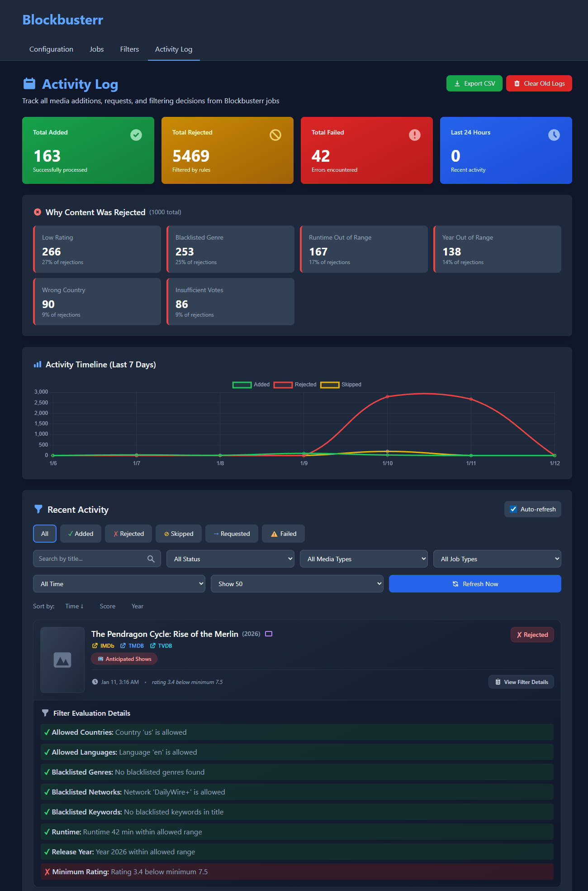

# Blockbusterr

**Automate your media library. Stop manually managing Trakt lists.**

Blockbusterr automatically adds trending, popular, and highly-rated content from Trakt to your Radarr/Sonarr library. Smart filters ensure you only get what you want.

[](https://github.com/Mahcks/blockbusterr/releases)
[](https://github.com/mahcks/blockbusterr/pkgs/container/blockbusterr)
[](LICENSE)

---

## Table of Contents

- [Quick Start](#quick-start)
- [Why Blockbusterr?](#why-blockbusterr)
- [Core Features](#core-features)
- [Installation](#installation)
- [Setup Guide](#setup-guide)
- [Jobs Explained](#jobs-explained)
- [Filters & Scoring](#filters--scoring)
- [Configuration](#configuration)
- [Troubleshooting](#troubleshooting)
- [API Reference](#api-reference)

---

## Quick Start

**Get running in 3 steps:**

### 1. Launch Blockbusterr

```bash
docker run -d \
  --name blockbusterr \
  -p 9090:9090 \
  -v $(pwd)/data:/app/data \
  ghcr.io/mahcks/blockbusterr:latest
```

### 2. Connect Your Services

Open `http://localhost:9090` → **Configuration** tab

- Add your Trakt API credentials ([Get them here](https://trakt.tv/oauth/applications))
- Connect Radarr (URL + API key)
- Connect Sonarr (URL + API key)
- Test connections ✓


### 3. Enable a Job

Go to **Jobs** tab → Enable "Trending Movies" → Done!


Blockbusterr will now automatically add trending movies to your library. Check the **Activity** tab to see what's been added.

*Preview of the **Activity** tab*


---

## Why Blockbusterr?

### The Problem with Manual Trakt Lists

Managing Trakt lists in Radarr/Sonarr manually is tedious:

- ❌ Configure each list separately in each app
- ❌ Accept everything from a list (no "top 5" option)
- ❌ No filtering by rating, country, genre, or quality
- ❌ No unified view of what was added
- ❌ Repeat the whole process for every list

### The Blockbusterr Solution

- ✅ **One Dashboard** - Manage both movies and TV shows in one place
- ✅ **Smart Limits** - "Top 5 trending" instead of "all 100"
- ✅ **Powerful Filters** - Country, language, genre, runtime, year, keywords, ratings
- ✅ **Activity Tracking** - See what was added, when, and why
- ✅ **Job Preview** - Test before enabling to see what would be added
- ✅ **Two Modes** - Direct add to *arr or route through Jellyseerr for approval

### Feature Comparison

| Feature | Manual Trakt Lists | Blockbusterr |
|---------|-------------------|--------------|
| **Setup** | Configure in each *arr app | One unified config |
| **Limits** | All or nothing | Top N items per job |
| **Filters** | None | Rating, country, genre, runtime, keywords, year |
| **Management** | Multiple apps | Single dashboard |
| **Activity Log** | Check each app separately | Unified log with posters |
| **Preview** | Blind faith | See what would be added before enabling |
| **Multi-user** | Direct add only | Optional Jellyseerr approval workflow |

---

## Core Features

### 17 Automated Jobs

Pull content from Trakt automatically. Each job works for both **movies** and **TV shows**:

| Job Type | Description | Best For |
|----------|-------------|----------|
| **Trending** | What's hot right now | Current buzz, viral content |
| **Popular** | Most watched this week | Mainstream hits, crowd favorites |
| **Smart Popular** `NEW` | Popular with adaptive ratings | Balanced quality + popularity |
| **Box Office** | Top movies at the box office | Latest theatrical releases |
| **Anticipated** | Most anticipated upcoming | Future releases, hype trains |Koofr
| **Favorited** | Most favorited by period | Community favorites |
| **Played** | Most played by time period | Actually watched content |
| **Watched** | Most watched by period | High completion rate |
| **Collected** | Most collected | Library staples |

**Total: 17 jobs** (9 job types × movies + shows, except Box Office which is movies only)

### Smart Popular Jobs (Adaptive Rating Thresholds)

**The Problem:** Popular blockbusters with thousands of votes often have "average" ratings (6-7) even when they're great. Hidden gems with fewer votes need higher ratings to prove quality.

**The Solution:** Smart Popular jobs automatically adjust rating requirements based on popularity:

- **High popularity** (90th percentile) → Needs **6.2** rating
- **Average popularity** (50th percentile) → Needs **7.0** rating  
- **Low popularity** (10th percentile) → Needs **7.8** rating

**Configuration:**
```yaml
smart_popular_movies:
  enabled: true
  limit: 20
  base_min_rating: 7.0      # Baseline rating requirement
  adjustment_factor: 2.0     # How aggressive (0.5 = mild, 2.0 = aggressive)
```

**Formula:** `threshold = base_min_rating - ((percentile - 0.5) × adjustment_factor)`

**Why This Works:**
- Gets you blockbusters without missing them due to "average" ratings
- Maintains quality standards for lesser-known content  
- Balances mainstream appeal with quality control

### Job Preview System

**See exactly what will be added before enabling any job.**

- **Visual Preview** - Poster grid with TMDB integration (optional)
- **Filter Results** - See which items pass/fail your filters and why
- **Already in Library** - Identify content you already have
- **Stats Breakdown** - Total found, filtered out, already exists, will add
- **Tab Navigation** - Filter by status (All / Will Add / Exists / Filtered)

**How to Use:**
1. Configure a job with your filters and limits
2. Click **"Preview"** button
3. Review what would be added
4. Adjust filters if needed
5. Enable when satisfied

**TMDB Posters (Optional):** Add your TMDB API key for beautiful poster images. Without it, you'll get a clean list view. [Get free key →](https://www.themoviedb.org/settings/api)

### Smart Filtering System

Control exactly what gets added to your library:

| Filter Type | Example Use Case |
|-------------|------------------|
| **Country & Language** | Only US/UK English content |
| **Genre Blacklists** | Block documentaries, reality TV |
| **Network Blacklists** | Block Hallmark, Nickelodeon |
| **Runtime Ranges** | Feature films only (90-180 mins) |
| **Year Ranges** | Only content from 2020+ |
| **Keyword Blacklists** | Block "christmas", "holiday" themes |
| **ID Blacklists** | Block specific TMDB/TVDB IDs |
| **Rating Thresholds** | Only 6.5/10 or higher |
| **Vote Thresholds** | Require 1000+ votes (reliable ratings) |

**Rating Quality Control Example:**
```yaml
filters:
  movies:
    min_rating: 6.5     # Only add movies rated 6.5/10+
    min_votes: 1000     # Require 1000+ votes (prevents niche/unreliable ratings)
```

Filtered content is logged with the reason: _"rating 5.2 below minimum 6.5"_

### Content Scoring System

**Rank content intelligently based on multiple factors:**

```
Final Score = (Rating × weight) + (Popularity × weight) + (Recency × weight)
```

Each component normalized to 0-1, then weighted based on your preferences.

**Configuration Presets:**

| Preset | Rating | Popularity | Recency | Best For |
|--------|--------|------------|---------|----------|
| **Quality-Focused** | 0.8 | 0.1 | 0.1 | Highly-rated classics |
| **Trending-Focused** | 0.3 | 0.6 | 0.1 | Viral/popular content |
| **Balanced** (default) | 0.6 | 0.3 | 0.1 | Mix of quality + popularity |
| **New Releases** | 0.4 | 0.2 | 0.4 | Recently released content |

**Example:**
_"The Batman (2022)"_ - Rating: 7.9/10, Votes: 50,000, Recent release  
Score: `(0.79 × 0.6) + (0.90 × 0.3) + (1.0 × 0.1) = 0.844` → **84%**

**Visual Indication in Activity Log:**
- **80%+** - Excellent (green)
- **60-79%** - Good (blue)
- **40-59%** - Fair (yellow)
- **<40%** - Poor (gray)

### Two Integration Modes

#### Direct Mode (Default)
- Adds content straight to Radarr/Sonarr
- Immediate download based on *arr settings
- **Best for:** Single-user home servers

#### Jellyseerr Mode  
- Routes requests through Jellyseerr/Overseerr
- Approval workflow for multi-user setups
- Quota management and request tracking
- **Best for:** Multi-user servers, manual approval preferred

**Authentication Options:**
- **API Key:** Auto-approve all requests (admin privileges)
- **Username/Password:** Respects user permissions, requires approval

### Web Dashboard

**Configuration Tab:**
- Connect Trakt, Radarr, Sonarr with connection testing
- Load quality profiles and root folders
- Configure TMDB for poster images

**Filters Tab:**
- Visual filter configuration
- Test filters against current Trakt data

**Jobs Tab:**
- Enable/disable jobs
- Set limits and schedules  
- Manual job triggers
- Job preview

**Activity Tab:**
- Real-time activity log with posters
- Filter by job type, status, date
- See why content was added or rejected

### Flexible Scheduling

**Simple Duration Format:**
```yaml
sync_interval: "30m"    # Every 30 minutes
sync_interval: "2h"     # Every 2 hours
sync_interval: "24h"    # Daily
```

**Cron Expressions (Advanced):**
```yaml
sync_interval: "0 2 * * *"       # Daily at 2 AM
sync_interval: "0 */6 * * *"     # Every 6 hours
sync_interval: "0 0 * * 0"       # Weekly on Sunday
sync_interval: "0 10,14,18 * * *"  # 10 AM, 2 PM, 6 PM
```

---

## Installation

### Docker (Recommended)

**Quick Start:**
```bash
docker run -d \
  --name blockbusterr \
  -p 9090:9090 \
  -v $(pwd)/data:/app/data \
  ghcr.io/mahcks/blockbusterr:latest
```

**Docker Compose:**
```yaml
version: '3.8'
services:
  blockbusterr:
    image: ghcr.io/mahcks/blockbusterr:latest
    container_name: blockbusterr
    ports:
      - "9090:9090"
    volumes:
      - ./data:/app/data
    environment:
      - TZ=America/New_York
    restart: unless-stopped
```

**Pre-configured with Environment Variables:**
```bash
docker run -d \
  --name blockbusterr \
  -p 9090:9090 \
  -v $(pwd)/data:/app/data \
  -e TRAKT_CLIENT_ID=your_client_id \
  -e TRAKT_CLIENT_SECRET=your_secret \
  -e RADARR_URL=http://radarr:7878 \
  -e RADARR_API_KEY=your_key \
  -e SONARR_URL=http://sonarr:8989 \
  -e SONARR_API_KEY=your_key \
  ghcr.io/mahcks/blockbusterr:latest
```

### Build from Source

**Requirements:** Go 1.24+

```bash
# Clone repository
git clone https://github.com/Mahcks/blockbusterr.git
cd blockbusterr

# (Optional) Copy example config
cp config/config.example.yaml config.yaml

# Build and run
go build -o bin/blockbusterr cmd/app/main.go
./bin/blockbusterr
```

**Access:** Open `http://localhost:9090`

---

## Setup Guide

### Step 1: Get Trakt API Credentials

1. Go to https://trakt.tv/oauth/applications
2. Click **"New Application"**
3. Fill in:
   - **Name:** Blockbusterr
   - **Redirect URI:** `urn:ietf:wg:oauth:2.0:oob`
   - **Permissions:** Check all
4. Save your **Client ID** and **Client Secret**

[Detailed Trakt Setup Guide →](docs/TMDB_SETUP.md)

### Step 2: Configure Integrations

Open `http://localhost:9090` → **Configuration** tab

**Required:**
- Trakt Client ID and Secret
- Radarr URL and API Key
- Sonarr URL and API Key

**Optional:**
- TMDB API Key (for poster images)
- Jellyseerr URL and API Key (for approval workflow)

**Test Connections:** Click the test button next to each service to verify.

### Step 3: Configure Filters (Recommended)

Go to **Filters** tab and set your preferences:

**Example - Family-Friendly Setup:**
```yaml
Movies:
  - Allowed Languages: English
  - Blacklisted Genres: horror, thriller
  - Blacklisted Keywords: explicit, unrated
  - Minimum Year: 2015

Shows:
  - Allowed Languages: English
  - Blacklisted Genres: horror, reality
  - Blacklisted Networks: HBO, Showtime
```

**Example - Quality Over Quantity:**
```yaml
Movies:
  - Minimum Rating: 6.5
  - Minimum Votes: 1000
  - Allowed Countries: US, GB, CA
  - Minimum Year: 2020
  - Minimum Runtime: 90 minutes
```

### Step 4: Enable Jobs

Go to **Jobs** tab:

1. Pick a job (e.g., "Trending Movies")
2. Set a limit (e.g., 10)
3. (Optional) Click **"Preview"** to see what would be added
4. Enable the job
5. Save configuration

**Recommended Starter Jobs:**
- Trending Movies (limit: 10)
- Popular Shows (limit: 5)
- Box Office (limit: 5)

### Step 5: Test It

**Manual Test:**
1. Go to **Jobs** tab
2. Click **"Trigger"** next to an enabled job
3. Go to **Activity** tab to see results
4. Check Radarr/Sonarr to verify content was added

**Check Logs:** If something goes wrong, check the Activity tab for error messages.

---

## Jobs Explained

### Job Types & When to Use Them

#### Trending (Movies & Shows)
**What it does:** Gets what's currently trending on social media and streaming platforms  
**Refresh rate:** Real-time trending (updates hourly)  
**Best for:** Staying current with viral content, water cooler conversations  
**Example:** When a show suddenly blows up on Twitter, it appears here

#### Popular (Movies & Shows)
**What it does:** Most watched content this week  
**Refresh rate:** Weekly aggregation  
**Best for:** Mainstream crowd-pleasers, safe bets  
**Example:** Blockbuster movies, popular network shows

#### Smart Popular (Movies & Shows)
**What it does:** Popular content with adaptive rating thresholds  
**How it's different:** Adjusts rating requirements based on popularity percentile  
**Best for:** Balancing quality with mainstream appeal  
**Example:** Gets you "Avengers" (popular, 7.5 rating) while filtering "Sharknado" (popular, 4.2 rating)  
**Configuration needed:** Base rating + adjustment factor

#### Box Office (Movies Only)
**What it does:** Current theatrical box office top performers  
**Refresh rate:** Weekly box office reports  
**Best for:** Latest theatrical releases  
**Example:** Current movies dominating theaters

#### Anticipated (Movies & Shows)
**What it does:** Most anticipated upcoming releases  
**Refresh rate:** Based on user anticipation tracking  
**Best for:** Upcoming content people are excited about  
**Example:** Sequel announcements, highly promoted new series

#### Favorited (Movies & Shows)
**What it does:** Most added to favorites by Trakt users  
**Periods:** Weekly, monthly, yearly, all-time  
**Best for:** Community-approved classics and gems  
**Example:** Shows that people love enough to favorite

#### Played (Movies & Shows)
**What it does:** Most played (by duration) in a time period  
**Periods:** Weekly, monthly, yearly, all-time  
**Best for:** Content people actually watch (not just start)  
**Example:** Shows with high rewatch value

#### Watched (Movies & Shows)
**What it does:** Most watched (unique users) in a time period  
**Periods:** Weekly, monthly, yearly, all-time  
**Best for:** High completion rate content  
**Example:** Shows that people finish, not abandon

#### Collected (Movies & Shows)
**What it does:** Most added to collections by Trakt users  
**Periods:** Weekly, monthly, yearly, all-time  
**Best for:** Library staples, must-haves  
**Example:** Classic films, definitive TV series

### Job Configuration Options

Each job can be configured with:

| Option | Description | Example |
|--------|-------------|---------|
| **Enabled** | Turn job on/off | ✓ Enabled |
| **Limit** | How many items to fetch | 10 |
| **Schedule** | How often to run | `2h` or `0 */6 * * *` |
| **Mode** | Direct or Jellyseerr | Direct |
| **Period** | For time-based jobs | weekly, monthly |
| **Advanced** | Job-specific settings | Smart Popular ratings |

### Example Job Setup

**Goal:** Keep library fresh with quality content

```yaml
jobs:
  sync_interval: "0 2 * * *"  # Run all jobs daily at 2 AM
  mode: "direct"              # Add directly to Radarr/Sonarr
  
  # Movies
  trending_movies:
    enabled: true
    limit: 5              # Top 5 trending
    
  smart_popular_movies:
    enabled: true
    limit: 10             # Top 10 popular with quality control
    base_min_rating: 7.0
    adjustment_factor: 2.0
    
  box_office:
    enabled: true
    limit: 5              # Top 5 box office
    
  # Shows
  trending_shows:
    enabled: true
    limit: 5              # Top 5 trending
    
  popular_shows:
    enabled: true
    limit: 5              # Top 5 popular
```

**Result:** Up to 30 new items per day (15 movies + 15 shows), all filtered by your quality settings.

---

## Filters & Scoring

### Understanding Filters

Filters are applied **after** jobs fetch content but **before** adding to Radarr/Sonarr. Think of them as your content bouncer.

**How it works:**
1. Job fetches trending movies (returns 100 items)
2. Filters apply (70 items rejected)
3. Limit applies (top 10 of remaining 30)
4. Add to Radarr (10 items added)

### Filter Types Explained

#### Country & Language Filters
**Purpose:** Only get content from specific regions/languages  
**Example:** US + UK + Canada English content only
```yaml
allowed_countries: ["us", "gb", "ca"]
allowed_languages: ["en"]
```

#### Genre Blacklist
**Purpose:** Block entire genres you don't want  
**Example:** No documentaries, reality TV, game shows
```yaml
blacklisted_genres: ["documentary", "reality", "game-show"]
```

#### Network Blacklist (Shows Only)
**Purpose:** Block content from specific TV networks  
**Example:** No Hallmark, Lifetime, or Nickelodeon
```yaml
blacklisted_networks: ["hallmark", "lifetime", "nickelodeon"]
```

#### Runtime Range
**Purpose:** Only feature films or specific episode lengths  
**Example:** Only 90-180 minute movies (no shorts or super long films)
```yaml
min_runtime: 90
max_runtime: 180
```

#### Year Range
**Purpose:** Only recent content or classics from specific eras  
**Example:** Only content from 2020 onwards
```yaml
min_year: 2020
max_year: 2026
```

#### Keyword Blacklist
**Purpose:** Block titles containing specific words  
**Example:** Block holiday movies
```yaml
blacklisted_keywords: ["christmas", "holiday", "valentine"]
```

#### TMDB/TVDB ID Blacklist
**Purpose:** Block specific titles by their database ID  
**Example:** Block franchises or series you don't want
```yaml
blacklisted_tmdb_ids: [123456, 789012]
blacklisted_tvdb_ids: [334455]
```

#### Rating & Vote Thresholds
**Purpose:** Quality control - only well-rated content  
**Example:** Only 6.5+ rating with at least 1000 votes
```yaml
min_rating: 6.5
min_votes: 1000
```

**Why both?** `min_votes` prevents obscure content with one 10/10 rating from sneaking through.

### Real-World Filter Examples

#### Family-Friendly Setup
```yaml
filters:
  movies:
    allowed_languages: ["en"]
    blacklisted_genres: ["horror", "thriller"]
    blacklisted_keywords: ["explicit", "unrated", "18+"]
    min_rating: 6.0
    min_year: 2015
  
  shows:
    allowed_languages: ["en"]
    blacklisted_genres: ["horror", "reality"]
    blacklisted_networks: ["hbo", "showtime", "starz"]
    min_rating: 6.5
```

#### Cinephile Quality Focus
```yaml
filters:
  movies:
    allowed_countries: ["us", "gb", "ca", "fr", "de"]
    min_rating: 7.0
    min_votes: 5000
    min_runtime: 90
    blacklisted_genres: ["documentary"]
    min_year: 2018
```

#### Block Holiday Content
```yaml
filters:
  movies:
    blacklisted_keywords: ["christmas", "holiday", "valentine", "halloween"]
  
  shows:
    blacklisted_keywords: ["christmas", "holiday"]
    blacklisted_networks: ["hallmark", "lifetime"]
```

#### Mainstream Only (No Indie/Obscure)
```yaml
filters:
  movies:
    min_votes: 10000      # Lots of people watched it
    min_rating: 6.0       # Decent quality
    allowed_countries: ["us", "gb", "ca"]  # Major markets only
```

### Content Scoring Deep Dive

**Why Scoring Matters:** When a job fetches 100 trending movies but your limit is 10, which 10 do you pick? Scoring ranks them intelligently.

**The Three Factors:**

1. **Rating Factor (0-1)**
   - Raw rating / max rating scale
   - Example: 7.5/10 = 0.75

2. **Popularity Factor (0-1)**
   - Based on vote count, normalized to percentile
   - Example: 50,000 votes at 90th percentile = 0.90

3. **Recency Factor (0-1)**
   - How recently released (0 = old, 1 = brand new)
   - Decays over configured window (default: 365 days)
   - Example: Released 30 days ago = 0.92

**Combining Them:**
```
Score = (Rating × Rating_Weight) + (Popularity × Popularity_Weight) + (Recency × Recency_Weight)
```

**Configuration:**
```yaml
scoring:
  enabled: true
  rating_weight: 0.6        # 60% influence
  popularity_weight: 0.3    # 30% influence
  recency_weight: 0.1       # 10% influence
  rating_scale: 10          # Trakt's 0-10 scale
  popularity_metric: votes  # Options: votes, views, watchers
  recency_days: 365         # Full recency score for anything < 365 days old
```

**Real Examples:**

| Movie | Rating | Votes | Days Old | Score | Result |
|-------|--------|-------|----------|-------|--------|
| The Batman | 7.9 | 50,000 | 30 | 0.844 | 84% |
| Indie Gem | 8.5 | 500 | 180 | 0.612 | 61% |
| Old Classic | 9.0 | 100,000 | 5000 | 0.700 | 70% |
| Recent Flop | 4.2 | 25,000 | 7 | 0.381 | 38% |

**Tuning Advice:**
- **Want classics?** Increase `rating_weight`, decrease `recency_weight`
- **Want trending?** Increase `popularity_weight` and `recency_weight`
- **Balanced library?** Keep default weights (0.6, 0.3, 0.1)

---

## Configuration

### Configuration Management

Blockbusterr offers two ways to manage configurations:

#### 1. Share Configuration (Safe to Share)

**What's Included:**
- Job settings (enabled, limits, schedules)
- Filter configurations
- Scoring settings

**What's NOT Included:**
- API keys and secrets
- Integration URLs
- Passwords or credentials

**Use Cases:**
- Share your setup with the community
- Try community-created configurations
- Test different filter setups

**How to Use:**
```bash
# Export (safe to share publicly)
Go to Configuration → Share Configuration → Download Shareable

# Import  
Go to Configuration → Share Configuration → Upload & Apply
```

#### 2. Full Backup & Restore (Keep Private)

**What's Included:**
- Everything from shareable config
- All API keys and secrets
- Integration URLs and credentials
- Complete configuration state

**Use Cases:**
- Personal backups
- Disaster recovery
- Server migration
- Testing without losing current setup

**How to Use:**
```bash
# Backup (contains credentials - keep secure!)
Go to Configuration → Backup & Restore → Download Backup

# Restore
Go to Configuration → Backup & Restore → Restore Backup
# ⚠️ A backup of current config is created automatically first
```

**API Usage:**
```bash
# Export shareable (no credentials)
curl -o shareable.yaml http://localhost:9090/config/export

# Full backup (with credentials)
curl -o backup.yaml http://localhost:9090/config/backup

# Restore
curl -X POST -F "config=@backup.yaml" http://localhost:9090/config/restore
```

### Manual Configuration File

If you prefer YAML over the web UI, create `config/config.yaml`:

```yaml
# Trakt Integration (Required)
trakt:
  client_id: "your_client_id"
  client_secret: "your_client_secret"

# TMDB Integration (Optional - for poster images)
tmdb:
  api_key: "your_tmdb_api_key"

# Radarr Integration (Required for movies)
radarr:
  url: "http://localhost:7878"
  api_key: "your_radarr_api_key"
  quality_profile: 1
  root_folder: "/movies"

# Sonarr Integration (Required for shows)
sonarr:
  url: "http://localhost:8989"
  api_key: "your_sonarr_api_key"
  quality_profile: 1
  root_folder: "/tv"

# Jellyseerr Integration (Optional - for approval workflow)
jellyseerr:
  url: "http://localhost:5055"
  api_key: "your_jellyseerr_api_key"
  user_id: ""
  # Optional: Non-admin user auth (requires approval)
  request_credentials:
    email: "blockbusterr-bot@example.com"
    password: "your_password"

# Job Configuration
jobs:
  sync_interval: "0 2 * * *"  # Cron: Daily at 2 AM
  mode: "direct"              # "direct" or "jellyseerr"
  
  trending_movies:
    enabled: true
    limit: 10
  
  smart_popular_movies:
    enabled: true
    limit: 15
    base_min_rating: 7.0
    adjustment_factor: 2.0
  
  popular_shows:
    enabled: true
    limit: 5

# Content Filters
filters:
  movies:
    allowed_countries: ["us", "gb", "ca"]
    allowed_languages: ["en"]
    blacklisted_genres: ["documentary"]
    blacklisted_keywords: ["christmas", "holiday"]
    min_rating: 6.5
    min_votes: 1000
    min_runtime: 90
    min_year: 2020
  
  shows:
    allowed_languages: ["en"]
    blacklisted_genres: ["reality", "game-show"]
    blacklisted_networks: ["hallmark", "lifetime"]
    min_rating: 6.0
    min_votes: 500

# Scoring Configuration
scoring:
  enabled: true
  rating_weight: 0.6
  popularity_weight: 0.3
  recency_weight: 0.1
  rating_scale: 10
  popularity_metric: votes
  recency_days: 365
```

### Environment Variables

Override config values via environment:

```bash
# REST API
REST_PORT=9090

# Trakt
TRAKT_CLIENT_ID=your_id
TRAKT_CLIENT_SECRET=your_secret

# TMDB
TMDB_API_KEY=your_key

# Radarr
RADARR_URL=http://radarr:7878
RADARR_API_KEY=your_key

# Sonarr
SONARR_URL=http://sonarr:8989
SONARR_API_KEY=your_key

# Jellyseerr
JELLYSEERR_URL=http://jellyseerr:5055
JELLYSEERR_API_KEY=your_key

# UI
DISABLE_UI=false  # Set to "true" to disable web UI
```

**Docker Example:**
```yaml
environment:
  - TRAKT_CLIENT_ID=${TRAKT_CLIENT_ID}
  - TRAKT_CLIENT_SECRET=${TRAKT_CLIENT_SECRET}
  - RADARR_URL=http://radarr:7878
  - RADARR_API_KEY=${RADARR_API_KEY}
  - SONARR_URL=http://sonarr:8989
  - SONARR_API_KEY=${SONARR_API_KEY}
  - TZ=America/New_York
```

---

## Troubleshooting

### Jobs Not Running

**Symptoms:** Jobs show as enabled but nothing is being added

**Check:**
1. Jobs are enabled in Jobs tab
2. Trakt credentials are valid (test connection)
3. Radarr/Sonarr URLs and API keys are correct
4. Schedules are configured (not left blank)
5. Filters aren't too strict (temporarily disable to test)

**Debug Steps:**
1. Go to **Jobs** tab
2. Click **"Trigger"** next to the job to run it manually
3. Check **Activity** tab for errors
4. Look for "rejected" items with reasons

### Connection Test Failures

**Common Issues:**

| Error | Cause | Fix |
|-------|-------|-----|
| "Connection refused" | Service not running | Start Radarr/Sonarr |
| "Timeout" | Wrong URL/port | Verify URL and port number |
| "Invalid API key" | Wrong/expired key | Generate new API key |
| "DNS lookup failed" | Container networking | Use container names or `host.docker.internal` |

**Docker Networking:**
```bash
# If Radarr/Sonarr are in Docker
RADARR_URL=http://radarr:7878  # Use container name

# If Radarr/Sonarr are on host machine
RADARR_URL=http://host.docker.internal:7878  # Docker Desktop
RADARR_URL=http://172.17.0.1:7878            # Docker on Linux
```

**URL Validation:**
- `http://localhost:7878` → Valid
- `http://radarr:7878` → Valid
- `https://radarr.example.com:7878` → Valid
- `http://localhost:7878/` → Invalid (remove trailing slash)
- `localhost:7878` → Auto-corrected (missing `http://` added automatically)

### No Content Being Added

**Symptoms:** Jobs run successfully but nothing appears in Radarr/Sonarr

**Common Causes:**

1. **Filters Too Strict**
   - Check Activity tab for "rejected" items
   - Temporarily disable all filters to test
   - Gradually re-enable to find the culprit

2. **Already in Library**
   - Blockbusterr skips content already in Radarr/Sonarr
   - Check Activity tab for "already exists" messages

3. **Limits Too Low**
   - Increase job limit (e.g., 5 → 20)
   - Remember: limit applies AFTER filtering

4. **Wrong Integration Mode**
   - Check if using Jellyseerr mode but Jellyseerr isn't configured
   - Switch to Direct mode temporarily to test

**Debug Process:**
```bash
1. Disable ALL filters
2. Set job limit to 20
3. Trigger job manually
4. Check Activity tab
   - If content added → filters were too strict
   - If still nothing → integration issue
```

### Config Not Saving

**Symptoms:** Changes in web UI don't persist after restart

**Check:**
1. `/app/data` volume is mounted and writable
2. Not running container as read-only
3. File permissions allow writes

**Docker Fix:**
```bash
# Check volume
docker inspect blockbusterr | grep -A 10 Mounts

# Fix permissions
chmod -R 755 ./data
```

**Note:** Comments in manually edited YAML files are removed when saving through web UI (Viper library limitation).

### TMDB Posters Not Loading

**Symptoms:** No posters in Activity tab or Preview

**Check:**
1. TMDB API key is configured in Configuration tab
2. TMDB API key is valid (test at themoviedb.org)
3. Rate limit not exceeded (free tier: 40 requests/10 seconds)

**Without TMDB:**
- Posters won't show (expected behavior)
- Activity tab shows clean list view instead
- All functionality works, just no images

**Get TMDB API Key:**
1. Create account at themoviedb.org
2. Go to Settings → API
3. Request API key (free)
4. Add to Blockbusterr config

### Activity Log Shows "Rejected"

**Symptoms:** Items appear in Activity log as "rejected" with reasons

**This is normal!** Blockbusterr logs **why** content was filtered out for transparency.

**Common Rejection Reasons:**
- `rating 5.2 below minimum 6.5`
- `genre 'documentary' is blacklisted`
- `runtime 45 outside range 90-180`
- `country 'DE' not in allowed list`
- `votes 250 below minimum 1000`

**To Fix:**
- Review your filters
- Decide if rejection was intentional
- Adjust filters if too strict

---

## API Reference

Full API documentation: [docs/API.md](docs/API.md)

### Quick Reference

**Base URL:** `http://localhost:9090`

#### Jobs API

```bash
# Get all job statuses
GET /api/v1/jobs/status

# Trigger job manually
POST /api/v1/jobs/trigger/:job-name?dry_run=false

# Preview job (see what would be added)
POST /api/v1/jobs/preview/:job-name

# Examples:
curl -X POST http://localhost:9090/api/v1/jobs/trigger/trending-movies
curl -X POST http://localhost:9090/api/v1/jobs/preview/smart-popular-movies
```

**Available Job Names:**
- `trending-movies`, `trending-shows`
- `popular-movies`, `popular-shows`
- `smart-popular-movies`, `smart-popular-shows`
- `anticipated-movies`, `anticipated-shows`
- `favorited-movies`, `favorited-shows`
- `played-movies`, `played-shows`
- `watched-movies`, `watched-shows`
- `collected-movies`, `collected-shows`
- `box-office`

#### Activity API

```bash
# Get recent activity logs
GET /api/v1/activity/logs?limit=50&offset=0

# Get activity statistics
GET /api/v1/activity/stats

# Clear old logs (30+ days)
DELETE /api/v1/activity/logs?days=30
```

#### Configuration API

```bash
# Save configuration
POST /api/v1/config/save

# Export shareable config (no credentials)
GET /config/export

# Import shareable config
POST /config/import

# Create full backup (with credentials)
GET /config/backup

# Restore full backup
POST /config/restore
```

#### Trakt Data API

```bash
# Get trending movies/shows
GET /api/v1/trakt/trending/movies?limit=20
GET /api/v1/trakt/trending/shows?limit=20

# Get popular movies/shows
GET /api/v1/trakt/popular/movies?limit=20
GET /api/v1/trakt/popular/shows?limit=20

# Get metadata
GET /api/v1/trakt/genres/movies
GET /api/v1/trakt/genres/shows
GET /api/v1/trakt/countries
GET /api/v1/trakt/languages
GET /api/v1/trakt/networks
```

---

## Screenshots

<details>
<summary>View Screenshots</summary>

**Configuration Page**


**Jobs Overview**


**Movie Filters**


**Show Filters**


</details>

---

## Contributing

Contributions are welcome! Here's how:

1. **Fork** the repository
2. **Create** a feature branch: `git checkout -b feature/amazing-thing`
3. **Commit** your changes: `git commit -m 'Add amazing thing'`
4. **Push** to the branch: `git push origin feature/amazing-thing`
5. **Open** a Pull Request

**Before Submitting:**
- Run tests: `go test ./...`
- Run linter: `go vet ./...`
- Test Docker build: `docker build .`

---

## License

MIT License - see [LICENSE](LICENSE) file for details

---

## Credits

**Built with:**
- [Fiber](https://github.com/gofiber/fiber) - Fast HTTP framework
- [Viper](https://github.com/spf13/viper) - Configuration management
- [robfig/cron](https://github.com/robfig/cron) - Cron scheduling
- [Trakt.tv API](https://trakt.tv) - Content data source

**Special Thanks:**
- Trakt.tv for their excellent API
- The *arr community (Radarr, Sonarr, Jellyseerr teams)
- All contributors and users providing feedback

---

## Support

- **Bug Reports:** [GitHub Issues](https://github.com/Mahcks/blockbusterr/issues)
- **Feature Requests:** [GitHub Issues](https://github.com/Mahcks/blockbusterr/issues)
- **Documentation:** [GitHub Wiki](https://github.com/Mahcks/blockbusterr/wiki)

---

## Star History

If this project saves you time, consider giving it a star!

[](https://star-history.com/#Mahcks/blockbusterr&Date)

---

**Made for the *arr community**
