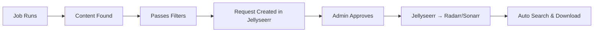

import { Tabs, TabItem, Card, CardGrid, Aside, Badge } from '@astrojs/starlight/components';

Blockbusterr supports two integration modes for adding content to your library.

## Quick Comparison

<CardGrid>
<Card title="Direct Mode" icon="rocket">
<Badge text="Recommended for Single Users" variant="success" />

**Fully automated** - Content added immediately to Radarr/Sonarr without approval.

**Best for:** Personal servers, solo users, complete automation
</Card>
<Card title="Jellyseerr Mode" icon="approve-check">
<Badge text="Recommended for Multi-User" variant="tip" />

**Request-based** - Content creates Jellyseerr requests requiring approval.

**Best for:** Family servers, shared libraries, curated collections
</Card>
</CardGrid>

## Direct Mode

<Badge text="Automation" variant="note" /> <Badge text="Single User" variant="success" />

Content is added directly to Radarr and Sonarr without any approval workflow.

### How It Works


1. **Job runs** on schedule (e.g., daily at midnight)
2. **Content found** from Trakt (trending, popular, etc.)
3. **Filters applied** - reject low-rated or unwanted content
4. **Directly added** to Radarr/Sonarr
5. **Auto-search** starts immediately

### Configuration

<Tabs>
<TabItem label="Basic" icon="pencil">

```yaml
integration:
  mode: "direct"

radarr:
  enabled: true
  url: "http://radarr:7878"
  api_key: "your_radarr_api_key"
  quality_profile_id: 1
  root_folder: "/movies"

sonarr:
  enabled: true
  url: "http://sonarr:8989"
  api_key: "your_sonarr_api_key"
  quality_profile_id: 1
  root_folder: "/tv"
```

</TabItem>
<TabItem label="Advanced" icon="setting">

```yaml
integration:
  mode: "direct"

radarr:
  enabled: true
  url: "http://radarr:7878"
  api_key: "your_radarr_api_key"
  quality_profile_id: 4  # HD-1080p
  root_folder: "/movies"
  search_on_add: true     # Auto-search immediately
  monitor: true           # Monitor for upgrades
  minimum_availability: "announced"  # Add as soon as announced

sonarr:
  enabled: true
  url: "http://sonarr:8989"
  api_key: "your_sonarr_api_key"
  quality_profile_id: 3   # HD-720p/1080p
  root_folder: "/tv"
  search_on_add: true
  monitor: "all"          # Monitor all episodes
  season_folder: true     # Organize by season
  series_type: "standard" # Standard, daily, or anime
```

</TabItem>
<TabItem label="Docker Network" icon="seti:docker">

When running in Docker, use container names:

```yaml
radarr:
  url: "http://radarr:7878"  # Not localhost!
  
sonarr:
  url: "http://sonarr:8989"  # Not localhost!
```

<Aside type="caution">
Using `localhost` or `127.0.0.1` will point to the Blockbusterr container itself, not your host machine!
</Aside>

</TabItem>
</Tabs>

### Pros & Cons

<CardGrid>
<Card title="✅ Pros" icon="approve-check">
- Fully automated, zero manual work
- Faster content acquisition
- Simpler setup (no Jellyseerr needed)
- Direct control over Radarr/Sonarr settings
- Perfect for trusted filters
</Card>
<Card title="❌ Cons" icon="warning">
- No approval workflow
- Can't manually review before adding
- Not ideal for shared servers
- No user request tracking
- Less control over disk usage
</Card>
</CardGrid>

### Use Cases

<Tabs>
<TabItem label="Personal Server" icon="laptop">

**Scenario:** Single user with trusted filters.

```yaml
jobs:
  curated_movies:
    type: "movie"
    list_type: "trakt_popular"
    fetch_count: 50
    threshold_score: 75  # High bar
    schedule: "0 0 * * 0"  # Weekly
```

**Result:** 10-15 high-quality movies added automatically every week.

</TabItem>
<TabItem label="Aggressive Collector" icon="rocket">

**Scenario:** Large storage, want everything trending.

```yaml
jobs:
  trending_everything:
    type: "movie"
    list_type: "trakt_trending"
    fetch_count: 500
    threshold_score: 50  # Low bar
    schedule: "0 */6 * * *"  # Every 6 hours
```

**Result:** Hundreds of items added daily.

</TabItem>
</Tabs>

## Jellyseerr Mode

<Badge text="Multi-User" variant="tip" /> <Badge text="Approval" variant="note" />

Content creates requests in Jellyseerr which require approval before being sent to Radarr/Sonarr.

### How It Works



1. **Job runs** and finds content
2. **Filters applied** - basic quality check
3. **Request created** in Jellyseerr
4. **Admin approval** required (or auto-approved based on Jellyseerr settings)
5. **Jellyseerr sends** to Radarr/Sonarr
6. **Download starts**

### Configuration

<Tabs>
<TabItem label="Basic" icon="pencil">

```yaml
integration:
  mode: "jellyseerr"

jellyseerr:
  enabled: true
  url: "http://jellyseerr:5055"
  api_key: "your_jellyseerr_api_key"
```

<Aside type="note">
Radarr and Sonarr configuration is done in Jellyseerr's settings, not Blockbusterr.
</Aside>

</TabItem>
<TabItem label="Auto-Approve" icon="star">

Configure Jellyseerr to auto-approve high-scoring requests:

**In Jellyseerr Settings:**
1. Go to **Settings** → **Users**
2. Set **Auto-Approve** for specific users
3. Or set global auto-approve threshold

**In Blockbusterr:**
```yaml
jobs:
  high_quality_movies:
    threshold_score: 85  # Only excellent content
```

**Result:** Scores 85+ auto-approved, others need manual review.

</TabItem>
<TabItem label="Request Limits" icon="setting">

Prevent request spam with Jellyseerr quotas:

**In Jellyseerr:**
- Set **Request Limits** per user (e.g., 10 requests per week)
- Set **Request Approval Required** for new users

**In Blockbusterr:**
```yaml
jobs:
  popular_movies:
    fetch_count: 30  # Limit how many requests created
```

</TabItem>
</Tabs>

### Pros & Cons

<CardGrid>
<Card title="✅ Pros" icon="approve-check">
- Manual review before adding
- Request tracking and history
- Multi-user support with quotas
- Can deny bad suggestions
- Better disk space control
- User request management
</Card>
<Card title="❌ Cons" icon="warning">
- Requires manual approval (unless auto-approve)
- Extra service to maintain (Jellyseerr)
- Slightly more complex setup
- Slower content acquisition
- Jellyseerr configuration needed
</Card>
</CardGrid>

### Use Cases

<Tabs>
<TabItem label="Family Server" icon="star">

**Scenario:** Multiple family members using Plex/Jellyfin.

```yaml
integration:
  mode: "jellyseerr"

jobs:
  family_friendly:
    type: "movie"
    threshold_score: 65
    schedule: "0 8 * * *"
```

**In Jellyseerr:**
- Kids have 5 requests/week
- Parents can auto-approve
- All requests tracked

</TabItem>
<TabItem label="Curated Library" icon="heart">

**Scenario:** Quality over quantity, manual curation.

```yaml
jobs:
  award_winners:
    type: "movie"
    list_type: "trakt_anticipated"
    threshold_score: 70
    schedule: "0 0 * * 1"  # Weekly
```

**Workflow:**
1. Blockbusterr creates 20-30 requests/week
2. Admin reviews each one
3. Approves 10-15 best options
4. Library stays high quality

</TabItem>
</Tabs>

## Choosing the Right Mode

<Tabs>
<TabItem label="Decision Tree" icon="puzzle">

**Choose Direct Mode if:**
- ✅ You're the only user
- ✅ You trust your filters completely
- ✅ You want maximum automation
- ✅ You have large storage capacity
- ✅ You don't want to review requests

**Choose Jellyseerr Mode if:**
- ✅ Multiple users share your server
- ✅ You want to review before adding
- ✅ Storage is limited
- ✅ You run a curated library
- ✅ You need request tracking

</TabItem>
<TabItem label="Hybrid Approach" icon="rocket">

**Pro tip:** Use both modes with different jobs!

```yaml
integration:
  mode: "jellyseerr"  # Default mode

jobs:
  # Auto-add only the absolute best
  masterpiece_movies:
    type: "movie"
    threshold_score: 90  # Extremely high
    # These go through Jellyseerr
  
  # Everything else needs approval
  popular_movies:
    threshold_score: 65
    # These create requests in Jellyseerr
```

Then in Jellyseerr, set auto-approve for scores 90+ and manual review for 65-89.

</TabItem>
</Tabs>

## Switching Modes

<Aside type="caution" title="Switching Modes">
Changing modes doesn't affect existing content, only how new content is added.
</Aside>

To switch from Direct → Jellyseerr:

1. Update `config.yaml` to `mode: "jellyseerr"`
2. Add Jellyseerr configuration
3. Restart Blockbusterr
4. Future jobs will create Jellyseerr requests

To switch from Jellyseerr → Direct:

1. Update `config.yaml` to `mode: "direct"`
2. Add Radarr/Sonarr configuration
3. Restart Blockbusterr
4. Future jobs will add directly

## Next Steps

<CardGrid>
<Card title="Configure Jellyseerr" icon="star" href="/blockbusterr/integrations/jellyseerr">
Set up Jellyseerr integration
</Card>
<Card title="Configure Radarr" icon="laptop" href="/blockbusterr/integrations/radarr">
Set up Radarr for movies
</Card>
<Card title="Configure Sonarr" icon="television" href="/blockbusterr/integrations/sonarr">
Set up Sonarr for TV shows
</Card>
<Card title="Create Jobs" icon="rocket" href="/blockbusterr/concepts/jobs">
Set up automated jobs
</Card>
</CardGrid>
