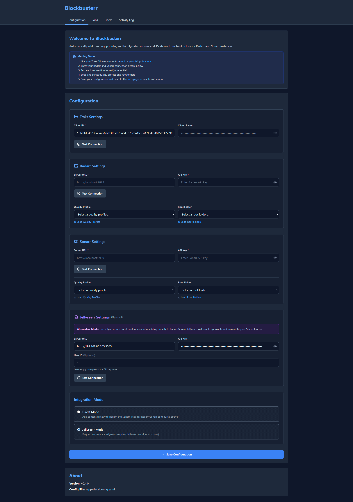
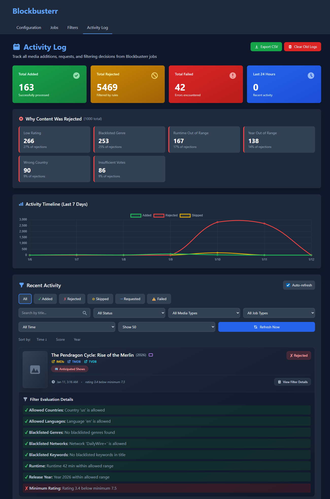

import { Tabs, TabItem, Steps, Badge, Card, CardGrid } from '@astrojs/starlight/components';

Get Blockbusterr up and running in 3 simple steps.

## Prerequisites

<CardGrid>
<Card title="Docker" icon="seti:docker">
Docker installed on your system
</Card>
<Card title="Trakt Account" icon="star">
Free account at [trakt.tv](https://trakt.tv/auth/join)
</Card>
<Card title="*arr Stack" icon="laptop">
Radarr/Sonarr (optional for testing)
</Card>
</CardGrid>

## Step 1: Launch Blockbusterr

<Tabs>
<TabItem label="Docker Run" icon="seti:docker">

```bash
docker run -d \
  --name blockbusterr \
  -p 9090:9090 \
  -v $(pwd)/data:/app/data \
  ghcr.io/mahcks/blockbusterr:latest
```

</TabItem>
<TabItem label="Docker Compose" icon="seti:yml">

```yaml
version: '3.8'
services:
  blockbusterr:
    image: ghcr.io/mahcks/blockbusterr:latest
    container_name: blockbusterr
    ports:
      - "9090:9090"
    volumes:
      - ./data:/app/data
    restart: unless-stopped
```

Then run:

```bash
docker-compose up -d
```

</TabItem>
<TabItem label="With Full Stack" icon="puzzle">

```yaml
version: '3.8'

networks:
  media:

services:
  blockbusterr:
    image: ghcr.io/mahcks/blockbusterr:latest
    container_name: blockbusterr
    networks:
      - media
    ports:
      - "9090:9090"
    volumes:
      - ./data:/app/data
    restart: unless-stopped
  
  radarr:
    # ... radarr config
    networks:
      - media
  
  sonarr:
    # ... sonarr config
    networks:
      - media
```

</TabItem>
</Tabs>

**Verify it's running:**

```bash
docker logs blockbusterr
```

You should see output indicating the server started on port 9090.

## Step 2: Create Trakt Application

<Steps>

1. Go to [Trakt API Applications](https://trakt.tv/oauth/applications/new)

2. Fill in the application details:
   - **Name**: Blockbusterr  
   - **Redirect URI**: `urn:ietf:wg:oauth:2.0:oob`  
   - **Permissions**: `/checkin`, `/scrobble`

3. Click **Save App** and copy your **Client ID** and **Client Secret**

</Steps>

## Step 3: Configure Blockbusterr

<Tabs>
<TabItem label="Web UI" icon="laptop">

Navigate to `http://localhost:9090` and fill in:

- **Trakt Client ID** & **Client Secret** (from Step 2)
- Click **Authorize Trakt** to connect your account
- Configure Radarr/Sonarr URLs and API keys (optional)

</TabItem>
<TabItem label="Manual Config" icon="pencil">

Create `data/config.yaml`:

```yaml
trakt:
  client_id: "your_client_id"
  client_secret: "your_client_secret"

# Optional: Add *arr integrations
radarr:
  api_url: "http://radarr:7878"
  api_key: "your_radarr_api_key"

sonarr:
  api_url: "http://sonarr:8989"
  api_key: "your_sonarr_api_key"
```

Restart the container:

```bash
docker restart blockbusterr
```

</TabItem>
</Tabs>

## What's Next?

<CardGrid>
<Card title="Set Up Scoring" icon="star" href="/blockbusterr/core-concepts/scoring">
Configure how movies/shows are scored
</Card>
<Card title="Configure Filters" icon="setting" href="/blockbusterr/core-concepts/filters">
Define what content to block or allow
</Card>
<Card title="Create Jobs" icon="rocket" href="/blockbusterr/core-concepts/jobs">
Automate your library management
</Card>
</CardGrid>

## Step 2: Configure Integrations

<Steps>

1. Open your browser and navigate to `http://localhost:9090`

   

2. **Connect Trakt** (Required)

   <Tabs>
     <TabItem label="Via Web UI" icon="laptop">
       1. Click **Configuration** tab
       2. Scroll to **Trakt** section
       3. Enter your Client ID and Client Secret ([Get them here](https://trakt.tv/oauth/applications))
       4. Click **"Authorize with Trakt"**
       5. Log in to Trakt and approve
       
       <Badge text="OAuth Complete" variant="success" />
     </TabItem>
     
     <TabItem label="Via Config File" icon="seti:yml">
       Edit `config/config.yaml`:
       ```yaml
       trakt:
         client_id: "your_client_id"
         client_secret: "your_client_secret"
       ```
       
       Then authorize via the Web UI to get tokens.
     </TabItem>
   </Tabs>

3. **Connect Radarr** (Optional)

   <Tabs>
     <TabItem label="Basic Setup" icon="rocket">
       ```yaml
       radarr:
         enabled: true
         url: "http://radarr:7878"  # Use container name
         api_key: "your_radarr_api_key"
         quality_profile_id: 1
         root_folder: "/movies"
       ```
     </TabItem>
     
     <TabItem label="Advanced Options" icon="setting">
       ```yaml
       radarr:
         enabled: true
         url: "http://radarr:7878"
         api_key: "your_radarr_api_key"
         quality_profile_id: 4  # HD-1080p
         root_folder: "/movies"
         search_on_add: true      # Auto search
         monitored: true          # Auto monitor
         minimum_availability: "released"
       ```
       
       **Availability Options:**
       - `announced` - As soon as announced
       - `inCinemas` - When in theaters  
       - `released` - When available (recommended)
       - `preDB` - Before public release
     </TabItem>
     
     <TabItem label="Test Connection" icon="approve-check">
       Click **"Test Connection"** in the UI
       
       Or via API:
       ```bash
       curl "http://localhost:9090/v1/radarr/validate"
       ```
       
       Expected response:
       ```json
       {
         "valid": true,
         "message": "Connection successful",
         "version": "4.7.5"
       }
       ```
     </TabItem>
   </Tabs>

4. **Connect Sonarr** (Optional) - Similar to Radarr setup

</Steps>

## Step 3: Configure Your First Job

<Steps>

1. **Choose a Job Type**

   <CardGrid>
     <Card title="Trending" icon="rocket">
       What's hot right now
       
       <Badge text="Best for: Current buzz" variant="tip" />
     </Card>
     <Card title="Popular" icon="star">
       Most watched this week
       
       <Badge text="Best for: Mainstream hits" variant="note" />
     </Card>
     <Card title="Smart Popular" icon="approve-check">
       Adaptive rating thresholds
       
       <Badge text="Best for: Balanced quality" variant="success" />
     </Card>
   </CardGrid>

2. **Configure with Filters**

   <Tabs>
     <TabItem label="Beginner" icon="rocket">
       Start conservative - high quality only:
       
       ```yaml
       jobs:
         trending_movies:
           enabled: true
           schedule: "0 */6 * * *"
           limit: 10
           filters:
             min_rating: 7.0
             min_votes: 2000
       ```
       
       <Badge text="~5-8 movies per run" variant="note" />
     </TabItem>
     
     <TabItem label="Moderate" icon="star">
       Balanced quality and quantity:
       
       ```yaml
       jobs:
         trending_movies:
           enabled: true
           schedule: "0 */6 * * *"
           limit: 20
           filters:
             min_rating: 6.5
             min_votes: 1000
             exclude_genres: ["Documentary"]
             include_languages: ["en"]
       ```
       
       <Badge text="~12-16 movies per run" variant="success" />
     </TabItem>
     
     <TabItem label="Advanced" icon="setting">
       Full control with scoring:
       
       ```yaml
       jobs:
         smart_popular_movies:
           enabled: true
           schedule: "0 */6 * * *"
           limit: 25
           base_min_rating: 7.0
           adjustment_factor: 2.0
           filters:
             min_votes: 1000
             min_year: 2020
             max_runtime: 180
             exclude_genres: ["Documentary", "Reality"]
             include_countries: ["us", "gb", "ca"]
           scoring:
             rating_weight: 0.5
             popularity_weight: 0.4
             recency_weight: 0.1
       ```
       
       <Badge text="~18-23 movies per run" variant="tip" />
     </TabItem>
   </Tabs>

3. **Preview Before Enabling**

   

   <Tabs>
     <TabItem label="Via Web UI" icon="laptop">
       1. Go to **Jobs** tab
       2. Click **"Preview"** button
       3. Review what would be added
       4. Check filter reasons for rejected items
       5. Adjust filters if needed
     </TabItem>
     
     <TabItem label="Via API" icon="rocket">
       ```bash
       curl -X POST http://localhost:9090/v1/jobs/preview/trending-movies
       ```
       
       Get only items that will be added:
       ```bash
       curl -s -X POST http://localhost:9090/v1/jobs/preview/trending-movies \
         | jq '.items[] | select(.filtered_out == false and .already_exists == false)'
       ```
     </TabItem>
   </Tabs>

4. **Enable and Monitor**

   - Save your configuration
   - Enable the job
   - Check the **Activity** tab to see what gets added
   
   

</Steps>

## What's Next?

- Learn about [different job types](/blockbusterr/concepts/jobs/)
- Configure [advanced filters and scoring](/blockbusterr/concepts/filters/)
- Set up [smart jobs](/blockbusterr/concepts/smart-jobs/) for adaptive content discovery
- Explore the [API reference](/blockbusterr/api/overview/)

## Troubleshooting

**Container won't start?**
- Check Docker logs: `docker logs blockbusterr`
- Ensure port 9090 is not already in use

**Can't connect to Radarr/Sonarr?**
- Verify the URL is accessible from within the Docker container
- Use container names if using Docker networking (e.g., `http://radarr:7878`)
- Check API keys are correct

**Jobs not running?**
- Verify the job is enabled in the configuration
- Check the schedule format is valid (cron syntax)
- View logs for errors
